OSH demos
================
AS Huffmyer
2026

This script analyzes resazurin assays conducted at VIMS for OSH demos

# Set up

Set up workspace, set options, and load required packages.

``` r
knitr::opts_chunk$set(echo = TRUE, warning = FALSE, message = FALSE)
```

Load libraries.

``` r
library(MASS) 
library(tidyverse)
library(ggplot2)
library(readxl)
library(cowplot)
library(lme4)
library(lmerTest)
library(car)
library(effects)
library(emmeans)
library(tools)
library(pracma)
library(rptR)
library(fda)
library(nls2)
library(purrr)
library(broom)
library(pheatmap)
library(vegan)
library(ggridges)
library(ggpubr)
library(broom.mixed)
```

# Resazurin Trials

## Load data

``` r
# Set the folder path
folder_path <- "data/OSH-demo/plate-files/"  

# List all txt files in the folder
file_list <- list.files(path = folder_path, pattern = "\\.xlsx$", full.names = TRUE, recursive=TRUE)

# Check if any files are found
if (length(file_list) == 0) {
  stop("No xlsx files found in the specified folder. Check the folder path or file extension.")
}

# Initialize an empty list to store processed data
data_list <- list()

# Loop through each file and load the data
for (file in file_list) {
  # Ensure file is a character string
  if (!is.character(file)) next
  
  # Extract file name without extension
  file_name <- file_path_sans_ext(basename(file))
  
  # Read Excel file, skipping the first 9 rows
  data <- read_excel(file, skip = 10, col_names = FALSE)

  # Keep only the first 8 rows (row 1–8 after - skip)
  data <- data[1:8, ]
  
  # Assign column names: first column is row labels (A–H), others are 1–12
  colnames(data) <- c("Row", as.character(1:12))
  
  #remove first column
  #data<-data%>%select(!"Row")
  
  # Convert to long format
  data_long <- data %>%
    pivot_longer(cols = -Row, names_to = "Column", values_to = "Value") %>%
    mutate(
      Column = sprintf("%02d", as.integer(Column)),  # Ensure two-digit column numbers
      Well_ID = paste0(Row, Column),                # Format well ID as "A01", "B02", etc.
      FileName = file_name,                          # Add file name
      plate = str_extract(file_name, "Plate\\d+"),  # Extract "plateX"
      date = str_extract(file_name, "^\\d{8}"),     # Extract 8-digit date
      timepoint = str_extract(file_name, "T\\d+") %>% 
        str_remove("T") %>% 
        as.numeric()                                # Convert timepoint to numeric
    ) %>%
    select(FileName, Well_ID, Value, date, plate, timepoint)  # Select relevant columns
  
  # Store the processed data in the list
  data_list[[file_name]] <- data_long
}

# Print an example of processed data
head(data_list[[file_name]])
```

    ## # A tibble: 6 × 6
    ##   FileName                   Well_ID Value date     plate  timepoint
    ##   <chr>                      <chr>   <dbl> <chr>    <chr>      <dbl>
    ## 1 20260113_OSHDEMO_Plate3_T3 A01     1811. 20260113 Plate3         3
    ## 2 20260113_OSHDEMO_Plate3_T3 A02     2489. 20260113 Plate3         3
    ## 3 20260113_OSHDEMO_Plate3_T3 A03     1992. 20260113 Plate3         3
    ## 4 20260113_OSHDEMO_Plate3_T3 A04     2454. 20260113 Plate3         3
    ## 5 20260113_OSHDEMO_Plate3_T3 A05     2331. 20260113 Plate3         3
    ## 6 20260113_OSHDEMO_Plate3_T3 A06     1952. 20260113 Plate3         3

``` r
# Combine all data frames into a single data frame (optional)
combined_data <- bind_rows(data_list, .id = "Source")

# Print the first few rows of the combined data (optional)
head(combined_data)
```

    ## # A tibble: 6 × 7
    ##   Source                     FileName        Well_ID Value date  plate timepoint
    ##   <chr>                      <chr>           <chr>   <dbl> <chr> <chr>     <dbl>
    ## 1 20260113_OSHDEMO_Plate1_T0 20260113_OSHDE… A01      31.4 2026… Plat…         0
    ## 2 20260113_OSHDEMO_Plate1_T0 20260113_OSHDE… A02      30.7 2026… Plat…         0
    ## 3 20260113_OSHDEMO_Plate1_T0 20260113_OSHDE… A03      30.9 2026… Plat…         0
    ## 4 20260113_OSHDEMO_Plate1_T0 20260113_OSHDE… A04      31.0 2026… Plat…         0
    ## 5 20260113_OSHDEMO_Plate1_T0 20260113_OSHDE… A05      32.6 2026… Plat…         0
    ## 6 20260113_OSHDEMO_Plate1_T0 20260113_OSHDE… A06      32.2 2026… Plat…         0

``` r
# Rename columns
combined_data<-combined_data%>%
  rename("well"=Well_ID, resazurin_counts=`Value`)%>%
  mutate(timepoint=as.character(timepoint))

head(combined_data)
```

    ## # A tibble: 6 × 7
    ##   Source                   FileName well  resazurin_counts date  plate timepoint
    ##   <chr>                    <chr>    <chr>            <dbl> <chr> <chr> <chr>    
    ## 1 20260113_OSHDEMO_Plate1… 2026011… A01               31.4 2026… Plat… 0        
    ## 2 20260113_OSHDEMO_Plate1… 2026011… A02               30.7 2026… Plat… 0        
    ## 3 20260113_OSHDEMO_Plate1… 2026011… A03               30.9 2026… Plat… 0        
    ## 4 20260113_OSHDEMO_Plate1… 2026011… A04               31.0 2026… Plat… 0        
    ## 5 20260113_OSHDEMO_Plate1… 2026011… A05               32.6 2026… Plat… 0        
    ## 6 20260113_OSHDEMO_Plate1… 2026011… A06               32.2 2026… Plat… 0

Load in metadata.

``` r
metadata<-read_xlsx(path="data/OSH-demo/metadata.xlsx")%>%
  mutate(date=as.character(date))
```

Join with data frame and remove any wells that did not have samples.

``` r
str(combined_data)
```

    ## tibble [1,152 × 7] (S3: tbl_df/tbl/data.frame)
    ##  $ Source          : chr [1:1152] "20260113_OSHDEMO_Plate1_T0" "20260113_OSHDEMO_Plate1_T0" "20260113_OSHDEMO_Plate1_T0" "20260113_OSHDEMO_Plate1_T0" ...
    ##  $ FileName        : chr [1:1152] "20260113_OSHDEMO_Plate1_T0" "20260113_OSHDEMO_Plate1_T0" "20260113_OSHDEMO_Plate1_T0" "20260113_OSHDEMO_Plate1_T0" ...
    ##  $ well            : chr [1:1152] "A01" "A02" "A03" "A04" ...
    ##  $ resazurin_counts: num [1:1152] 31.4 30.7 30.9 31 32.6 ...
    ##  $ date            : chr [1:1152] "20260113" "20260113" "20260113" "20260113" ...
    ##  $ plate           : chr [1:1152] "Plate1" "Plate1" "Plate1" "Plate1" ...
    ##  $ timepoint       : chr [1:1152] "0" "0" "0" "0" ...

``` r
str(metadata)
```

    ## tibble [72 × 6] (S3: tbl_df/tbl/data.frame)
    ##  $ date       : chr [1:72] "20260113" "20260113" "20260113" "20260113" ...
    ##  $ plate      : chr [1:72] "Plate1" "Plate1" "Plate1" "Plate1" ...
    ##  $ well       : chr [1:72] "A01" "A02" "A03" "A04" ...
    ##  $ temperature: num [1:72] 40 40 40 40 40 40 40 40 40 40 ...
    ##  $ type       : chr [1:72] "sample" "sample" "sample" "sample" ...
    ##  $ treatment  : chr [1:72] "airdry" "airdry" "airdry" "airdry" ...

``` r
full_data<-left_join(combined_data, metadata, by=c("date", "well", "plate"))%>%
  filter(!is.na(type))

head(full_data)
```

    ## # A tibble: 6 × 10
    ##   Source FileName well  resazurin_counts date  plate timepoint temperature type 
    ##   <chr>  <chr>    <chr>            <dbl> <chr> <chr> <chr>           <dbl> <chr>
    ## 1 20260… 2026011… A01               31.4 2026… Plat… 0                  40 samp…
    ## 2 20260… 2026011… A02               30.7 2026… Plat… 0                  40 samp…
    ## 3 20260… 2026011… A03               30.9 2026… Plat… 0                  40 samp…
    ## 4 20260… 2026011… A04               31.0 2026… Plat… 0                  40 samp…
    ## 5 20260… 2026011… A05               32.6 2026… Plat… 0                  40 samp…
    ## 6 20260… 2026011… A06               32.2 2026… Plat… 0                  40 samp…
    ## # ℹ 1 more variable: treatment <chr>

Load in size data.

``` r
size<-read_xlsx("data/OSH-demo/size.xlsx")%>%
  mutate(date=as.character(date))
```

Join with data.

``` r
str(full_data)
```

    ## tibble [288 × 10] (S3: tbl_df/tbl/data.frame)
    ##  $ Source          : chr [1:288] "20260113_OSHDEMO_Plate1_T0" "20260113_OSHDEMO_Plate1_T0" "20260113_OSHDEMO_Plate1_T0" "20260113_OSHDEMO_Plate1_T0" ...
    ##  $ FileName        : chr [1:288] "20260113_OSHDEMO_Plate1_T0" "20260113_OSHDEMO_Plate1_T0" "20260113_OSHDEMO_Plate1_T0" "20260113_OSHDEMO_Plate1_T0" ...
    ##  $ well            : chr [1:288] "A01" "A02" "A03" "A04" ...
    ##  $ resazurin_counts: num [1:288] 31.4 30.7 30.9 31 32.6 ...
    ##  $ date            : chr [1:288] "20260113" "20260113" "20260113" "20260113" ...
    ##  $ plate           : chr [1:288] "Plate1" "Plate1" "Plate1" "Plate1" ...
    ##  $ timepoint       : chr [1:288] "0" "0" "0" "0" ...
    ##  $ temperature     : num [1:288] 40 40 40 40 40 40 40 40 40 40 ...
    ##  $ type            : chr [1:288] "sample" "sample" "sample" "sample" ...
    ##  $ treatment       : chr [1:288] "airdry" "airdry" "airdry" "airdry" ...

``` r
str(size)
```

    ## tibble [48 × 4] (S3: tbl_df/tbl/data.frame)
    ##  $ date     : chr [1:48] "20260113" "20260113" "20260113" "20260113" ...
    ##  $ plate    : chr [1:48] "Plate1" "Plate1" "Plate1" "Plate1" ...
    ##  $ well     : chr [1:48] "A01" "A02" "A03" "A04" ...
    ##  $ length.mm: num [1:48] 26.6 20.6 21.8 31.1 23.2 ...

``` r
full_data<-left_join(full_data, size, by=c("date", "plate", "well"))
head(full_data)
```

    ## # A tibble: 6 × 11
    ##   Source FileName well  resazurin_counts date  plate timepoint temperature type 
    ##   <chr>  <chr>    <chr>            <dbl> <chr> <chr> <chr>           <dbl> <chr>
    ## 1 20260… 2026011… A01               31.4 2026… Plat… 0                  40 samp…
    ## 2 20260… 2026011… A02               30.7 2026… Plat… 0                  40 samp…
    ## 3 20260… 2026011… A03               30.9 2026… Plat… 0                  40 samp…
    ## 4 20260… 2026011… A04               31.0 2026… Plat… 0                  40 samp…
    ## 5 20260… 2026011… A05               32.6 2026… Plat… 0                  40 samp…
    ## 6 20260… 2026011… A06               32.2 2026… Plat… 0                  40 samp…
    ## # ℹ 2 more variables: treatment <chr>, length.mm <dbl>

``` r
full_data<-full_data%>%
  select(!Source)%>%
  select(!FileName)

head(full_data)
```

    ## # A tibble: 6 × 9
    ##   well  resazurin_counts date     plate  timepoint temperature type   treatment
    ##   <chr>            <dbl> <chr>    <chr>  <chr>           <dbl> <chr>  <chr>    
    ## 1 A01               31.4 20260113 Plate1 0                  40 sample airdry   
    ## 2 A02               30.7 20260113 Plate1 0                  40 sample airdry   
    ## 3 A03               30.9 20260113 Plate1 0                  40 sample airdry   
    ## 4 A04               31.0 20260113 Plate1 0                  40 sample airdry   
    ## 5 A05               32.6 20260113 Plate1 0                  40 sample airdry   
    ## 6 A06               32.2 20260113 Plate1 0                  40 sample airdry   
    ## # ℹ 1 more variable: length.mm <dbl>

## Prep the data

Plot the raw data.

``` r
full_data%>%
  ggplot(aes(x=timepoint, y=resazurin_counts, colour=treatment, group=interaction(date, plate, well)))+
  facet_wrap(~date)+
  geom_point()+
  geom_line()+
  theme_classic()
```

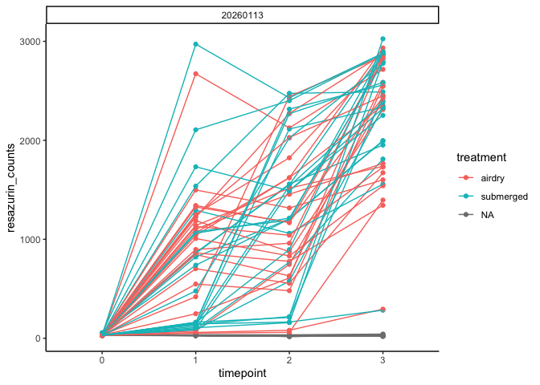<!-- -->

Calculate size normalized fluorescence at each time point normalized to
the starting value at time 0.

``` r
full_data<-full_data%>%
  group_by(date, plate, well, treatment)%>%
  arrange(date, plate, well)%>%
  mutate(fluorescence.norm=resazurin_counts/first(resazurin_counts))
```

Plot again.

``` r
full_data%>%
  ggplot(aes(x=timepoint, y=fluorescence.norm, colour=treatment, group=interaction(date, plate, well)))+
  facet_wrap(~date)+
  geom_point()+
  geom_line()+
  theme_classic()
```

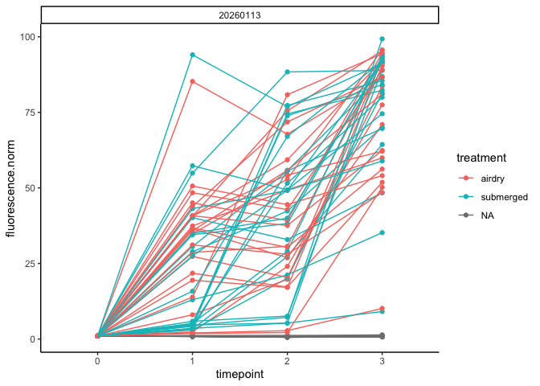<!-- -->

View blanks

``` r
full_data%>%
  filter(type=="blank")%>%
  ggplot(aes(x=timepoint, y=fluorescence.norm, group=interaction(date, plate, well)))+
  facet_wrap(~date)+
  geom_point()+
  geom_line()+
  theme_classic()
```

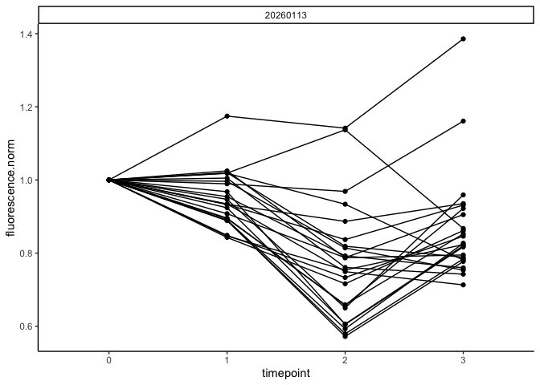<!-- -->

Calculate mean change in blank at each time point.

``` r
blanks<-full_data%>%
  filter(type=="blank")%>%
  group_by(date, timepoint)%>%
  summarise(mean_blank=mean(fluorescence.norm));blanks
```

    ## # A tibble: 4 × 3
    ## # Groups:   date [1]
    ##   date     timepoint mean_blank
    ##   <chr>    <chr>          <dbl>
    ## 1 20260113 0              1    
    ## 2 20260113 1              0.948
    ## 3 20260113 2              0.772
    ## 4 20260113 3              0.867

View summarized blank data.

``` r
blanks%>%
  ggplot(aes(x=timepoint, y=mean_blank))+
  facet_wrap(~date)+
  geom_point()+
  theme_classic()
```

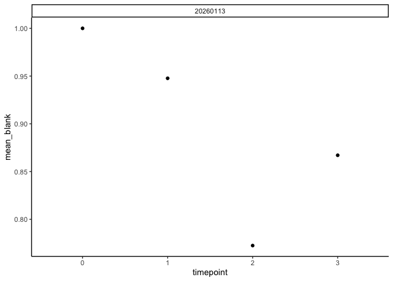<!-- -->

Subtract blank values from fluorescence values for oysters.

``` r
full_data<-left_join(full_data, blanks)

full_data<-full_data%>%
  filter(!type=="blank")%>%
  mutate(fluorescence.corr=fluorescence.norm-mean_blank)
```

Plot again.

``` r
full_data%>%
  ggplot(aes(x=timepoint, y=fluorescence.corr, colour=treatment, group=interaction(date, well, plate)))+
  facet_wrap(~date)+
  geom_point()+
  geom_line()+
  theme_classic()
```

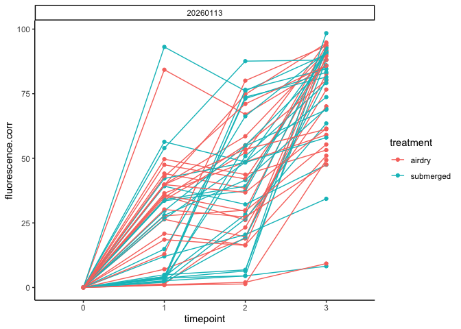<!-- -->

``` r
full_data%>%
  ggplot(aes(x=timepoint, y=fluorescence.corr, colour=length.mm, group=interaction(date, well, plate)))+
  facet_wrap(~date)+
  scale_colour_gradient(low="darkblue", high="red")+
  geom_point()+
  geom_line()+
  theme_classic()
```

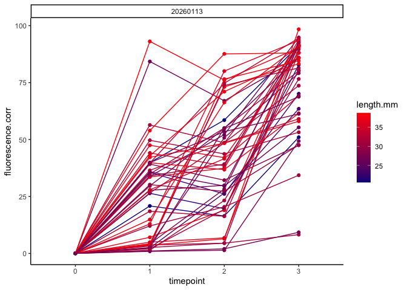<!-- -->

Size normalize data.

``` r
#normalize by length
full_data<-full_data%>%
  mutate(fluorescence.corr.mm=fluorescence.corr/length.mm)
```

Plot again.

Plot by area normalized.

``` r
full_data%>%
  ggplot(aes(x=timepoint, y=fluorescence.corr.mm, colour=treatment, group=interaction(date, well, plate)))+
  facet_wrap(~date)+
  geom_point()+
  geom_line()+
  theme_classic()
```

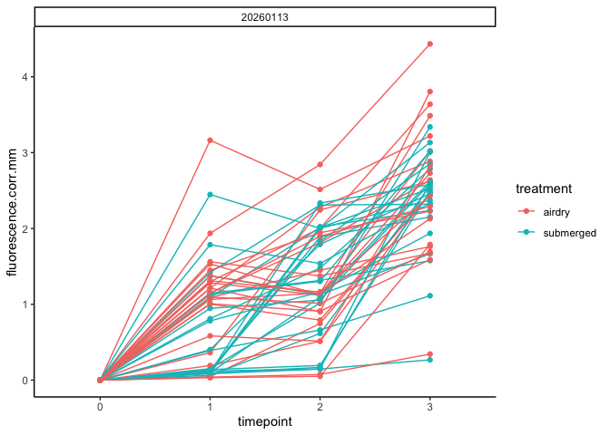<!-- -->

Plot by area normalized colored by size.

``` r
full_data%>%
  ggplot(aes(x=timepoint, y=fluorescence.corr.mm, colour=length.mm, group=interaction(date, well, plate)))+
  facet_wrap(~date)+
  scale_colour_gradient(low="darkblue", high="red")+
  geom_point()+
  geom_line()+
  theme_classic()
```

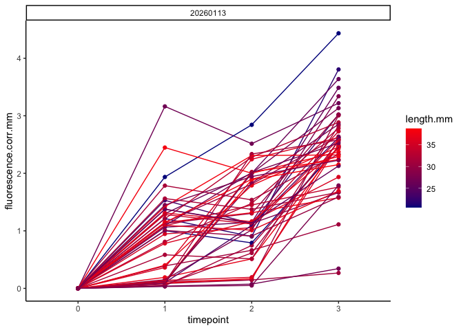<!-- -->

Remove unnecessary columns.

``` r
full_data<-full_data%>%
  #select(!resazurin_counts)%>%
  select(!type)#%>%
  #select(!mean_blank)
  #select(!length.mm)%>%
  #select(!fluorescence.corr)%>%
  #select(!fluorescence.norm)

full_data<-full_data%>%
  rename(value=fluorescence.corr.mm)
```

### Remove oversaturated samples

Remove any sample that reached \> 3000 raw value at any point during the
trials, these were over saturated and data is unreliable.

``` r
hist(full_data$resazurin_counts)
```

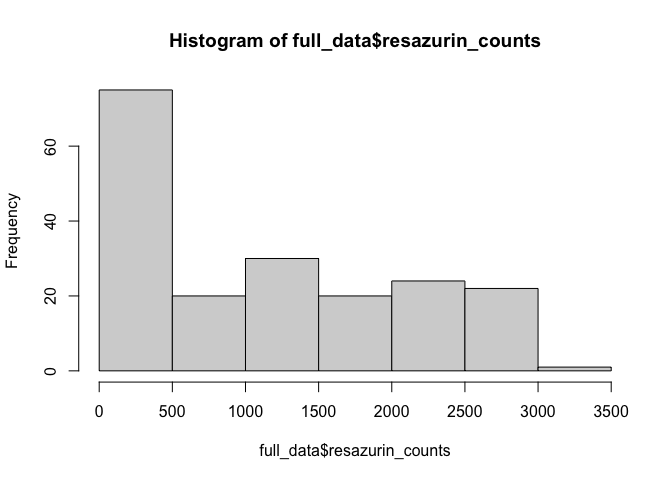<!-- -->

``` r
full_data%>%
  filter(resazurin_counts>3000)%>%
  group_by(date, plate, well)%>%
  mutate(unique=paste(date, plate, well))
```

    ## # A tibble: 1 × 13
    ## # Groups:   date, plate, well [1]
    ##   well  resazurin_counts date    plate timepoint temperature treatment length.mm
    ##   <chr>            <dbl> <chr>   <chr> <chr>           <dbl> <chr>         <dbl>
    ## 1 F04              3025. 202601… Plat… 3                  40 submerged      38.0
    ## # ℹ 5 more variables: fluorescence.norm <dbl>, mean_blank <dbl>,
    ## #   fluorescence.corr <dbl>, value <dbl>, unique <chr>

``` r
#there are no samples that went above the threshold 

list<-full_data%>%
  filter(resazurin_counts>3000)%>%
  group_by(date, plate, well)%>%
  mutate(unique=paste(date, plate, well))%>%
  pull(unique)%>%
  unique()
```

``` r
full_data<-full_data%>%
  mutate(unique=paste(date, plate, well))%>%
  filter(!unique %in% list)
```

View size range.

``` r
hist(full_data$length.mm)
```

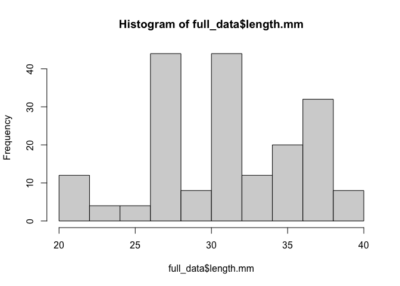<!-- -->

Plot again.

``` r
full_data%>%
  ggplot(aes(x=timepoint, y=value, colour=treatment, group=interaction(date, well, plate)))+
  facet_wrap(~date)+
  geom_point()+
  geom_line()+
  theme_classic()
```

<!-- -->

## Models and Plots

Plot data.

``` r
plot1<-full_data%>%
  ggplot(aes(x=timepoint, y=value, colour=treatment, group=interaction(date, treatment, plate, well)))+
  facet_wrap(~date)+
  geom_point()+
  geom_line()+
  theme_classic();plot1
```

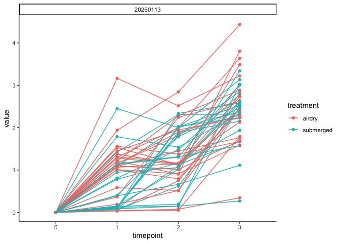<!-- -->

Run a model on metabolic rates.

``` r
model<-full_data%>%
  lmer(sqrt(value) ~ treatment * timepoint + (1|well:plate) + (1|plate), data=.)

anova(model)
```

    ## Type III Analysis of Variance Table with Satterthwaite's method
    ##                     Sum Sq Mean Sq NumDF DenDF  F value  Pr(>F)    
    ## treatment            0.107  0.1069     1    45   1.5910 0.21368    
    ## timepoint           58.816 19.6052     3   135 291.8373 < 2e-16 ***
    ## treatment:timepoint  0.646  0.2154     3   135   3.2069 0.02524 *  
    ## ---
    ## Signif. codes:  0 '***' 0.001 '**' 0.01 '*' 0.05 '.' 0.1 ' ' 1

``` r
qqPlot(residuals(model))
```

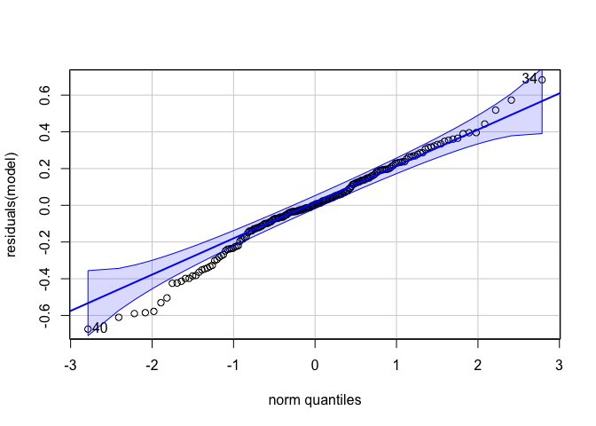<!-- -->

    ## [1] 34 40

``` r
leveneTest(sqrt(value) ~ treatment * timepoint, data=full_data)
```

    ## Levene's Test for Homogeneity of Variance (center = median)
    ##        Df F value    Pr(>F)    
    ## group   7  9.1615 1.137e-09 ***
    ##       180                      
    ## ---
    ## Signif. codes:  0 '***' 0.001 '**' 0.01 '*' 0.05 '.' 0.1 ' ' 1

Significant treatment x time effect - different metabolic rates.

Plot raw data for each ploidy

``` r
plot2<-full_data%>%
  ggplot(aes(x=timepoint, y=value, colour=treatment, group=interaction(date, treatment)))+
  geom_smooth(method="lm")+
  theme_classic();plot2
```

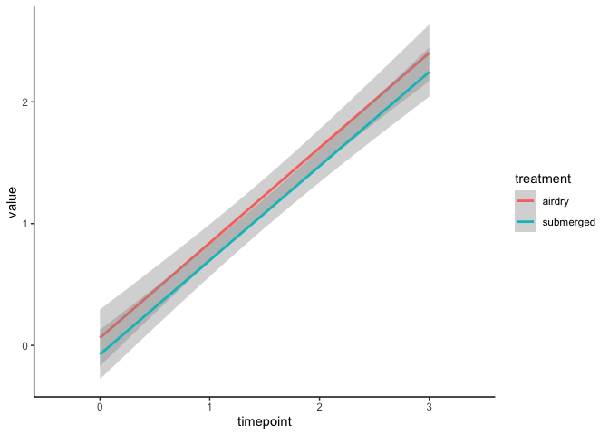<!-- -->

View sample size.

``` r
full_data%>%
  group_by(treatment, timepoint)%>%
  summarise(length(value))
```

    ## # A tibble: 8 × 3
    ## # Groups:   treatment [2]
    ##   treatment timepoint `length(value)`
    ##   <chr>     <chr>               <int>
    ## 1 airdry    0                      24
    ## 2 airdry    1                      24
    ## 3 airdry    2                      24
    ## 4 airdry    3                      24
    ## 5 submerged 0                      23
    ## 6 submerged 1                      23
    ## 7 submerged 2                      23
    ## 8 submerged 3                      23

Plot model estimates for metabolic rates for each ploidy

``` r
#predict data 
pred_data <- augment(model, full_data) %>%
  mutate(predicted_value_ploidy = (.fitted))  # back-transform to original scale

#plot with back transformed data 
plot2e<-ggplot(pred_data, aes(x = timepoint, y = predicted_value_ploidy^2, color = treatment, group = treatment, fill = treatment)) +
  stat_summary(fun = mean, geom = "line", linewidth = 1) +
  geom_vline(xintercept = 3, linetype="dashed")+
  stat_summary(
    fun.data = mean_se,
    geom = "ribbon",
    alpha = 0.2,
    color = NA
  ) +
  labs(
    title = "Modeled Metabolic Rate",
    x = "Timepoint",
    y = "Fold Change in Fluorescence"
  ) +
  theme_classic() +
  guides(fill = "none");plot2e  
```

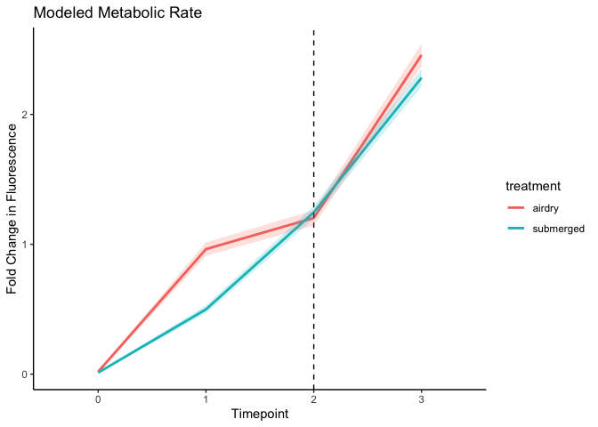<!-- -->

## Area under the curve

Area under the curve (AUC): Summarizes total metabolic activity per
oyster.

``` r
aucs <- full_data %>%
  mutate(time=as.numeric(timepoint))%>%
  group_by(date, plate, well, treatment) %>%
  summarise(AUC = trapz(time, value))
```

``` r
plot10<-ggplot(aucs, aes(x = treatment, y = AUC, colour = treatment)) +
  geom_violin(trim = FALSE) +
  geom_jitter(width = 0.1, alpha = 0.3) +
  labs(title = "AUC by Treatment", x = "Treatment", y = "AUC") +
  theme_classic();plot10
```

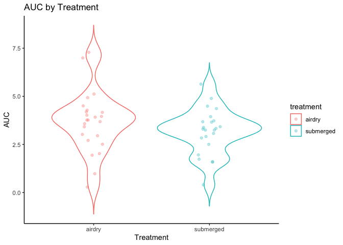<!-- -->

``` r
plot10a<-aucs%>%
  group_by(treatment)%>%
  summarise(mean=mean(AUC, na.rm=TRUE), se=(sd(AUC, na.rm=TRUE))/sqrt(length(AUC)))%>%
  
  ggplot(aes(x = reorder(treatment, mean), y = mean, colour = treatment)) +
  geom_point()+
  geom_errorbar(aes(ymin=mean-se, ymax=mean+se), width=0.1)+
  labs(title = "Total metabolic activity (AUC)", x = "Treatment", y = "AUC") +
  theme_classic();plot10a
```

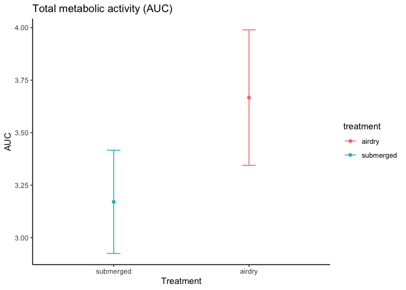<!-- -->

Model the data.

``` r
hist(sqrt(aucs$AUC))
```

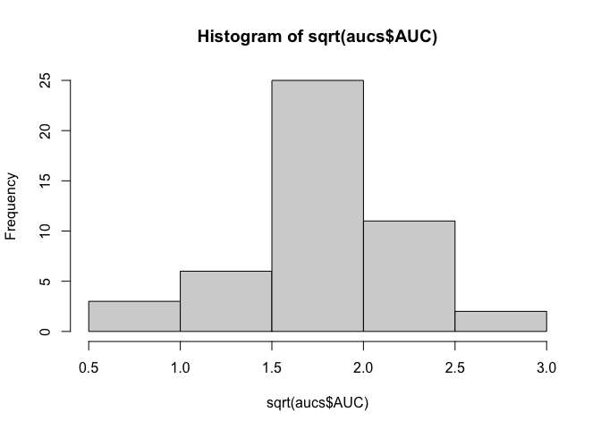<!-- -->

``` r
model<-lmer(sqrt(AUC) ~ treatment + (1|plate), data=aucs)

anova(model)
```

    ## Type III Analysis of Variance Table with Satterthwaite's method
    ##            Sum Sq Mean Sq NumDF DenDF F value Pr(>F)
    ## treatment 0.16328 0.16328     1    45  0.9136 0.3443

``` r
qqPlot(residuals(model))
```

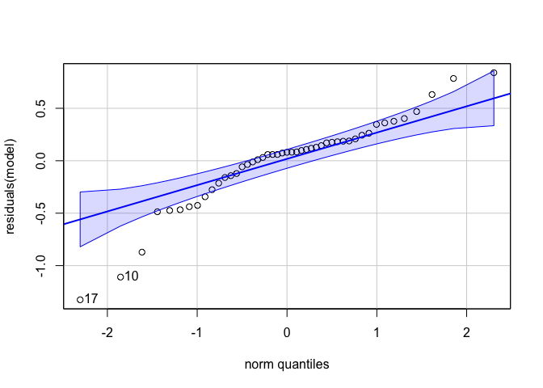<!-- -->

    ## [1] 17 10

## Ridge plots

View distrubution of fluorescence values over time.

``` r
plot14<-ggplot(full_data, aes(x = value, y = as.factor(timepoint), fill = treatment)) +
  geom_density_ridges(alpha = 0.7) +
  labs(title = "Distribution of Fluorescence by Treatment")+
  theme_classic();plot14
```

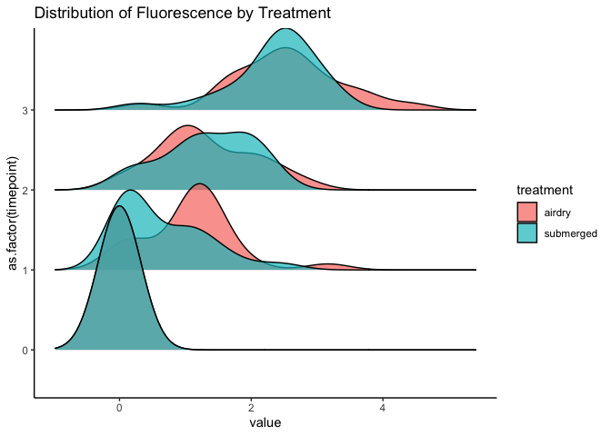<!-- -->
