resazurin-ploidy-index-catalogue-field-prediction
================
Steven Roberts
2026-09-19

-   [1 Background](#1-background)
    -   [1.1 Field phenotypes](#11-field-phenotypes)
    -   [1.2 Caveats (read first)](#12-caveats-read-first)
    -   [1.3 Expected inputs](#13-expected-inputs)
    -   [1.4 Expected outputs](#14-expected-outputs)
-   [2 Setup](#2-setup)
-   [3 Rebuild the resazurin signal from raw plate
    files](#3-rebuild-the-resazurin-signal-from-raw-plate-files)
    -   [3.1 Read raw fluorescence and real read
        times](#31-read-raw-fluorescence-and-real-read-times)
    -   [3.2 Attach metadata and assay-time
        size](#32-attach-metadata-and-assay-time-size)
    -   [3.3 Blank correction on two scales, then five value
        scales](#33-blank-correction-on-two-scales-then-five-value-scales)
    -   [3.4 Validate the rebuild against the processed
        CSV](#34-validate-the-rebuild-against-the-processed-csv)
-   [4 The index catalogue](#4-the-index-catalogue)
    -   [4.1 Feature definitions](#41-feature-definitions)
    -   [4.2 Compute features on every
        scale](#42-compute-features-on-every-scale)
    -   [4.3 De-duplicate: which indices are actually
        distinct?](#43-de-duplicate-which-indices-are-actually-distinct)
    -   [4.4 Size-and-plate adjusted
        versions](#44-size-and-plate-adjusted-versions)
-   [5 Field phenotypes](#5-field-phenotypes)
-   [6 Join and benchmark covariates](#6-join-and-benchmark-covariates)
-   [7 Screen 1: every index vs
    survival](#7-screen-1-every-index-vs-survival)
-   [8 Screen 2: every index vs continuous
    performance](#8-screen-2-every-index-vs-continuous-performance)
-   [9 Which normalization works
    best?](#9-which-normalization-works-best)
-   [10 How long does the assay need to
    run?](#10-how-long-does-the-assay-need-to-run)
-   [11 Cross-validation machinery](#11-cross-validation-machinery)
-   [12 Cross-validated prediction from the top single
    indices](#12-cross-validated-prediction-from-the-top-single-indices)
-   [13 Nested cross-validated composite
    indices](#13-nested-cross-validated-composite-indices)
-   [14 PCA: what are the main axes of metabolic variation, and do they
    matter?](#14-pca-what-are-the-main-axes-of-metabolic-variation-and-do-they-matter)
-   [15 Does the index-survival relationship differ by
    ploidy?](#15-does-the-index-survival-relationship-differ-by-ploidy)
-   [16 Screening utility: what would culling on the index
    buy?](#16-screening-utility-what-would-culling-on-the-index-buy)
-   [17 Best-index scatter and trajectory
    contrast](#17-best-index-scatter-and-trajectory-contrast)
-   [18 Synthesis](#18-synthesis)
    -   [18.1 What the data say (auto-generated from this
        render)](#181-what-the-data-say-auto-generated-from-this-render)
    -   [18.2 Interpretation](#182-interpretation)
    -   [18.3 Recommended next steps](#183-recommended-next-steps)
-   [19 Session info](#19-session-info)

# 1 Background

**Question:** *Of every index that can be gleaned from a 4-hour
resazurin run on an individual oyster, which ones forecast that same
animal’s field performance, and how should the assay be normalized,
truncated, and combined to do so?*

This notebook is a fresh, self-contained analysis of the 2025-08-26
ploidy trial. It starts from the **raw plate-reader files** rather than
from the processed `ploidy_metabolism.csv`, because several candidate
indices (absolute fluorescence, blank-subtracted resorufin production,
un-normalized fold change, actual elapsed read times, baseline
autofluorescence) are lost by the time the data reach the processed CSV.
It then joins each animal’s assay indices to the field outcomes recorded
for the *same individual* in
`data/ploidy/field/ploidy_field_performance.xlsx`.

It is modelled on the family-level prediction notebook in
`sormi-assay-development`
(`04-resazurin-family-phenotype-prediction.Rmd`), but differs in three
important ways:

1.  **Individual-level linkage.** The same animal was assayed, tagged,
    deployed, and sampled, so n is \~160 individuals, not \~9 family
    means.
2.  **Every scale and every feature.** Five value scales x \~45 curve
    features x two size/plate adjustments are catalogued, then
    de-duplicated, rather than a single pre-normalized scale.
3.  **Honest multiplicity control.** With several hundred candidate
    indices, nominal p-values are meaningless. Every screen is
    calibrated with a permutation null for the *best* index in the
    family, every composite is built with **nested** feature selection
    inside the cross-validation loop, and every out-of-sample score is
    compared with a ploidy + size + plate benchmark fitted the same way.

## 1.1 Field phenotypes

| Column                                                                        | Definition                                                 |
|:------------------------------------------------------------------------------|:-----------------------------------------------------------|
| `live_dead_sampling`                                                          | 1 = dead at field sampling, 0 = alive                      |
| `shell_height` (SH)                                                           | longest dimension, mm (also recorded for most dead shells) |
| `shell_length` (SL), `shell_width` (SW)                                       | across the fan; shortest dimension                         |
| `fan` = SL/SH, `cup` = SW/SH                                                  | shape ratios                                               |
| `whole_wet_weight` (WWW), `dry_shell_weight` (DSW), `dry_tissue_weight` (DTW) | g                                                          |
| `condition_index`                                                             | 100 x DTW / (WWW - DSW)                                    |

Derived here:

| Phenotype                | Definition                                                          | Animals                 |
|:-------------------------|:--------------------------------------------------------------------|:------------------------|
| `survived`               | 1 - `live_dead_sampling`                                            | all with a field record |
| `growth_abs`             | SH at sampling - shell length at assay (mm)                         | survivors               |
| `growth_log`             | log(SH / assay length)                                              | survivors               |
| `yield_dtw`, `yield_www` | DTW or WWW if alive, 0 if dead (harvest-style yield)                | all with a field record |
| `perf_composite`         | mean within-ploidy percentile of `growth_abs` and `condition_index` | survivors               |

## 1.2 Caveats (read first)

-   **One family, one date, one temperature.** All animals are HNRY,
    assayed on one day at 40 C. There is no unstressed control run, so
    “stress response” here means the trajectory under the 40 C
    challenge.
-   **Ploidy is confounded with plate column** (columns alternate
    diploid / triploid). Within-ploidy analyses are unaffected; pooled
    analyses use within-ploidy standardization and carry ploidy as a
    covariate.
-   **Deaths are few in diploids** (9 of \~80). Diploid-only survival
    results are low-powered; triploid (25 of \~78) and pooled results
    carry more weight.
-   **Field duration is unrecorded** in the repository, so growth is per
    deployment, not per day. Set `field_sampling_date` below when known.
-   **Morphometrics are survivors-only**, so growth and condition
    analyses are conditional on survival.

## 1.3 Expected inputs

| Path                                                 | Description                                                  |
|:-----------------------------------------------------|:-------------------------------------------------------------|
| `data/ploidy/plate-files/20250826/*.xlsx`            | Raw plate-reader exports (4 plates x 5 reads)                |
| `data/ploidy/metadata/ploidy_metadata_20250826.xlsx` | Well -&gt; ploidy / blank map                                |
| `data/ploidy/size-images/ploidy_size_20250826.xlsx`  | Shell length at assay (mm)                                   |
| `data/ploidy/field/ploidy_field_performance.xlsx`    | Field survival and morphometrics                             |
| `output/ploidy/ploidy_metabolism.csv`                | Existing processed signal, used only to validate the rebuild |

## 1.4 Expected outputs

All written to `output/ploidy/resazurin-index-catalogue/`.

| File                                | Description                                                                                |
|:------------------------------------|:-------------------------------------------------------------------------------------------|
| `signal_all_scales.csv`             | Per-well per-read values on every scale, with actual elapsed hours                         |
| `index_catalogue.csv`               | Every unique index per individual (long)                                                   |
| `index_dictionary.csv`              | What each index is, which scale/adjustment, and any duplicates it absorbed                 |
| `field_phenotypes.csv`              | Derived per-individual field phenotypes                                                    |
| `joined_indices_phenotypes.csv`     | Wide analysis table                                                                        |
| `screen_survival.csv`               | Every index vs survival: AUC, OR per SD, p, BH q, permutation family-wise p, per stratum   |
| `screen_continuous.csv`             | Every index vs each continuous phenotype: Spearman rho, p, BH q, permutation family-wise p |
| `cv_single_index.csv`               | Repeated stratified 10-fold CV for top single indices                                      |
| `nested_composite_cv.csv`           | Nested-CV composite index performance vs benchmarks                                        |
| `nested_composite_selection.csv`    | How often each index was selected inside the CV loop                                       |
| `assay_duration.csv`                | Predictive value of truncated-assay indices                                                |
| `scale_comparison.csv`              | Best association per scale x adjustment                                                    |
| `pca_index.csv`, `pca_loadings.csv` | PCA-derived metabolic axes and their associations                                          |
| `ploidy_interaction.csv`            | Does the index-survival relationship differ by ploidy?                                     |
| `screening_utility.csv`             | Survival by index quintile (what culling would buy)                                        |
| `figures/`                          | All figures                                                                                |

# 2 Setup

``` r
knitr::opts_chunk$set(
  echo = TRUE, eval = TRUE, warning = FALSE, message = FALSE,
  comment = "", results = "hold", fig.width = 9, fig.height = 6
)
```

``` r
suppressPackageStartupMessages({
  library(tidyverse)
  library(readxl)
  library(here)
  library(ggrepel)
  library(patchwork)
  library(knitr)
})
set.seed(20250826)
```

``` r
assay_date          <- "20250826"
field_sampling_date <- NA_character_   # e.g. "2026-07-15" once known
n_perm              <- params$n_perm  # permutations for family-wise calibration
loo_top_n           <- 6              # single indices per stratum to cross-validate
composite_k         <- if (isTRUE(params$dev)) 5 else c(3, 5, 8)  # composite sizes tried inside nested CV
cv_k                <- 10             # folds for repeated stratified CV
cv_repeats          <- if (isTRUE(params$dev)) 3 else 10           # CV repeats
min_completeness    <- 0.95           # an index must be present for >= 95% of animals to enter composites/PCA
saturation_rfu      <- 3000           # raw RFU ceiling (same rule as the trial notebook)

# Wells excluded in the processing notebook (dead before assay / unreliable)
exclude_wells <- c("plate3 E07", "plate3 F07", "plate3 F08", "plate4 F07")
```

``` r
plate_dir      <- here("data/ploidy/plate-files", assay_date)
metadata_path  <- here("data/ploidy/metadata", paste0("ploidy_metadata_", assay_date, ".xlsx"))
size_path      <- here("data/ploidy/size-images", paste0("ploidy_size_", assay_date, ".xlsx"))
field_path     <- here("data/ploidy/field/ploidy_field_performance.xlsx")
processed_path <- here("output/ploidy/ploidy_metabolism.csv")

out_dir <- here("output/ploidy/resazurin-index-catalogue")
fig_dir <- file.path(out_dir, "figures")
dir.create(fig_dir, recursive = TRUE, showWarnings = FALSE)

stopifnot(dir.exists(plate_dir), file.exists(metadata_path),
          file.exists(size_path), file.exists(field_path))
```

# 3 Rebuild the resazurin signal from raw plate files

## 3.1 Read raw fluorescence and real read times

Each export holds an 8 x 12 RFU block starting at row 11 and an ISO
timestamp on row 3. The timestamp gives the **actual** elapsed time of
each read, which differs from the nominal hour by 5-16 minutes and
differs between plates.

``` r
plate_files <- list.files(plate_dir, pattern = "[.]xlsx$", full.names = TRUE)
stopifnot(length(plate_files) == 20)

read_plate <- function(f) {
  hdr <- read_excel(f, col_names = FALSE, n_max = 4, .name_repair = "minimal")
  stamp <- as.POSIXct(as.character(hdr[[1]][3]),
                      format = "%Y-%m-%dT%H:%M:%S", tz = "America/New_York")
  blk <- read_excel(f, skip = 10, col_names = FALSE, n_max = 8,
                    .name_repair = "minimal")
  colnames(blk) <- c("row", sprintf("%02d", 1:12))
  fn <- tools::file_path_sans_ext(basename(f))
  blk %>%
    pivot_longer(-row, names_to = "col", values_to = "rfu") %>%
    mutate(
      well      = paste0(row, col),
      rfu       = as.numeric(rfu),
      date      = str_extract(fn, "^\\d{8}"),
      plate     = str_extract(fn, "plate\\d+"),
      timepoint = as.integer(str_remove(str_extract(fn, "T\\d+"), "T")),
      read_time = stamp
    )
}

raw <- map_dfr(plate_files, read_plate) %>%
  group_by(plate) %>%
  mutate(time_hr = as.numeric(difftime(read_time, min(read_time), units = "hours"))) %>%
  ungroup()

raw %>%
  distinct(plate, timepoint, read_time, time_hr) %>%
  arrange(plate, timepoint) %>%
  mutate(time_hr = round(time_hr, 3)) %>%
  kable(caption = "Actual elapsed hours of each plate read (from file timestamps)")
```

| plate  | timepoint | read\_time          | time\_hr |
|:-------|----------:|:--------------------|---------:|
| plate1 |         0 | 2025-08-26 10:09:27 |    0.000 |
| plate1 |         1 | 2025-08-26 11:14:02 |    1.076 |
| plate1 |         2 | 2025-08-26 12:14:35 |    2.086 |
| plate1 |         3 | 2025-08-26 13:21:40 |    3.204 |
| plate1 |         4 | 2025-08-26 14:14:43 |    4.088 |
| plate2 |         0 | 2025-08-26 10:21:56 |    0.000 |
| plate2 |         1 | 2025-08-26 11:28:45 |    1.114 |
| plate2 |         2 | 2025-08-26 12:28:47 |    2.114 |
| plate2 |         3 | 2025-08-26 13:37:42 |    3.263 |
| plate2 |         4 | 2025-08-26 14:30:01 |    4.135 |
| plate3 |         0 | 2025-08-26 10:35:28 |    0.000 |
| plate3 |         1 | 2025-08-26 11:44:38 |    1.153 |
| plate3 |         2 | 2025-08-26 12:45:05 |    2.160 |
| plate3 |         3 | 2025-08-26 13:44:13 |    3.146 |
| plate3 |         4 | 2025-08-26 14:43:17 |    4.130 |
| plate4 |         0 | 2025-08-26 10:47:37 |    0.000 |
| plate4 |         1 | 2025-08-26 11:58:52 |    1.188 |
| plate4 |         2 | 2025-08-26 12:59:00 |    2.190 |
| plate4 |         3 | 2025-08-26 13:59:30 |    3.198 |
| plate4 |         4 | 2025-08-26 14:54:33 |    4.116 |

Actual elapsed hours of each plate read (from file timestamps)

## 3.2 Attach metadata and assay-time size

``` r
metadata <- read_excel(metadata_path) %>%
  mutate(date = as.character(date), ploidy = str_to_lower(ploidy),
         family = str_to_lower(family))
size <- read_excel(size_path) %>%
  mutate(date = as.character(date)) %>%
  rename(length_mm = length.mm)

signal <- raw %>%
  inner_join(metadata, by = c("date", "plate", "well")) %>%
  left_join(size, by = c("date", "plate", "well")) %>%
  mutate(trace_id = paste(date, plate, well),
         row = str_sub(well, 1, 1), col = as.integer(str_sub(well, 2, 3)))

cat("Wells with metadata:", n_distinct(signal$trace_id), "\n")
count(signal %>% distinct(trace_id, plate, type), plate, type) %>% print()
```

    Wells with metadata: 192 
    # A tibble: 8 x 3
      plate  type       n
      <chr>  <chr>  <int>
    1 plate1 blank      6
    2 plate1 sample    42
    3 plate2 blank      6
    4 plate2 sample    42
    5 plate3 blank      6
    6 plate3 sample    42
    7 plate4 blank      6
    8 plate4 sample    42

## 3.3 Blank correction on two scales, then five value scales

Blanks (six seawater-only wells per plate) drift upward slowly. The
trial notebook corrects the *fold change* by subtracting the blank fold
change. To keep absolute information we also correct the *raw RFU* by
subtracting the mean blank RFU at the same plate and read. The five
scales carried forward:

| scale          | definition                             | what it keeps                                                             |
|:---------------|:---------------------------------------|:--------------------------------------------------------------------------|
| `raw_rfu`      | RFU - mean blank RFU (same plate/read) | absolute fluorescence, including baseline autofluorescence                |
| `raw_delta`    | `raw_rfu`(t) - `raw_rfu`(0)            | absolute resorufin produced                                               |
| `fc_corr`      | RFU/RFU(0) - mean blank fold change    | relative rate, no size normalization (trial notebook `fluorescence.corr`) |
| `fc_corr_mm`   | `fc_corr` / assay length (mm)          | the scale used downstream so far (trial notebook `value`)                 |
| `raw_delta_mm` | `raw_delta` / assay length (mm)        | absolute production per mm                                                |

``` r
blank_stats <- signal %>%
  filter(type == "blank") %>%
  group_by(plate, well) %>% arrange(timepoint, .by_group = TRUE) %>%
  mutate(fc = rfu / first(rfu)) %>% ungroup() %>%
  group_by(plate, timepoint) %>%
  summarise(blank_rfu = mean(rfu), blank_fc = mean(fc), .groups = "drop")

signal <- signal %>%
  filter(type == "sample") %>%
  left_join(blank_stats, by = c("plate", "timepoint")) %>%
  group_by(trace_id) %>% arrange(timepoint, .by_group = TRUE) %>%
  mutate(
    saturated    = any(rfu > saturation_rfu),
    raw_rfu      = rfu - blank_rfu,
    raw_delta    = raw_rfu - first(raw_rfu),
    fc_corr      = rfu / first(rfu) - blank_fc,
    fc_corr_mm   = fc_corr / length_mm,
    raw_delta_mm = raw_delta / length_mm
  ) %>%
  ungroup() %>%
  mutate(exclude_reason = case_when(
    paste(plate, well) %in% exclude_wells ~ "dead/unreliable before assay (trial notebook list)",
    saturated ~ "raw RFU above saturation ceiling",
    TRUE ~ NA_character_
  ))

signal %>% filter(!is.na(exclude_reason)) %>%
  distinct(trace_id, ploidy, exclude_reason) %>% print()

signal <- signal %>% filter(is.na(exclude_reason))
cat("\nAnimals carried forward:", n_distinct(signal$trace_id), "\n")

write_csv(signal %>% select(trace_id, date, plate, well, row, col, ploidy, family,
                            length_mm, timepoint, time_hr, rfu, blank_rfu, blank_fc,
                            raw_rfu, raw_delta, fc_corr, fc_corr_mm, raw_delta_mm),
          file.path(out_dir, "signal_all_scales.csv"))
```

    # A tibble: 4 x 3
      trace_id            ploidy   exclude_reason                                   
      <chr>               <chr>    <chr>                                            
    1 20250826 plate3 E07 triploid dead/unreliable before assay (trial notebook lis~
    2 20250826 plate3 F07 triploid dead/unreliable before assay (trial notebook lis~
    3 20250826 plate3 F08 diploid  dead/unreliable before assay (trial notebook lis~
    4 20250826 plate4 F07 triploid dead/unreliable before assay (trial notebook lis~

    Animals carried forward: 164 

## 3.4 Validate the rebuild against the processed CSV

`fc_corr_mm` should reproduce `value` in
`output/ploidy/ploidy_metabolism.csv` to numerical precision.

``` r
if (file.exists(processed_path)) {
  proc <- read_csv(processed_path, show_col_types = FALSE) %>%
    transmute(trace_id = unique, timepoint = as.integer(timepoint), value_processed = value)
  chk <- signal %>% select(trace_id, timepoint, fc_corr_mm) %>%
    inner_join(proc, by = c("trace_id", "timepoint"))
  cat("Rows compared:", nrow(chk),
      "| max |difference|:", format(max(abs(chk$fc_corr_mm - chk$value_processed)), digits = 3),
      "| traces only in processed:", n_distinct(setdiff(proc$trace_id, signal$trace_id)),
      "| traces only in rebuild:", n_distinct(setdiff(signal$trace_id, proc$trace_id)), "\n")
} else cat("Processed CSV not found; skipping validation.\n")
```

    Rows compared: 820 | max |difference|: 4.44e-16 | traces only in processed: 0 | traces only in rebuild: 0 

``` r
scale_levels <- c("raw_rfu", "raw_delta", "fc_corr", "fc_corr_mm", "raw_delta_mm")
signal_long <- signal %>%
  pivot_longer(all_of(scale_levels), names_to = "scale", values_to = "value") %>%
  mutate(scale = factor(scale, levels = scale_levels))

p_traj <- ggplot(signal_long, aes(time_hr, value, group = trace_id, colour = ploidy)) +
  geom_line(alpha = 0.25, linewidth = 0.4) +
  facet_wrap(~ scale, scales = "free_y", ncol = 5) +
  scale_colour_manual(values = c(diploid = "#0072B2", triploid = "#D55E00")) +
  labs(x = "Elapsed hours (actual)", y = "Value",
       title = "The same 164 trajectories on five value scales") +
  theme_classic(base_size = 10) + theme(legend.position = "bottom")
p_traj
```

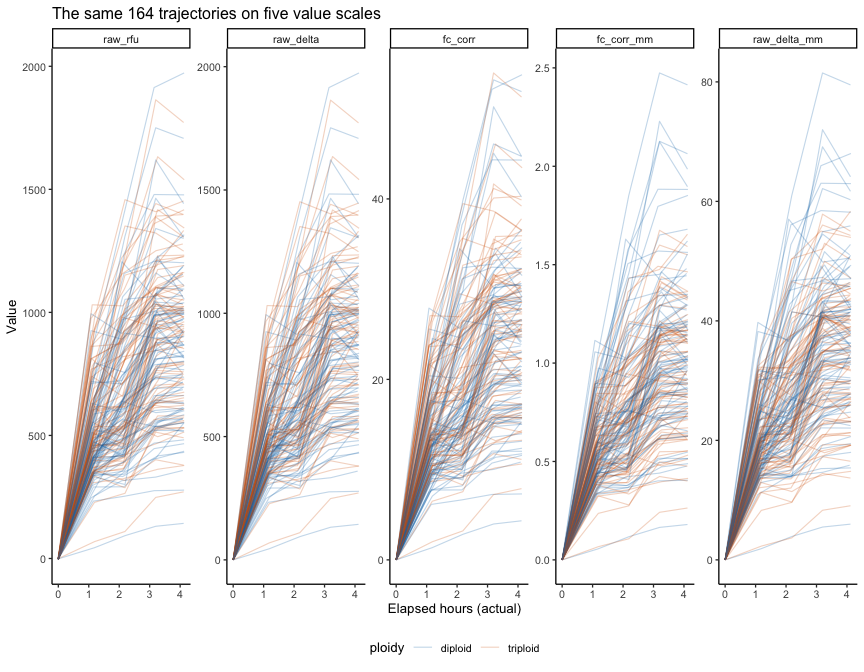<!-- -->

``` r
ggsave(file.path(fig_dir, "trajectories_by_scale.png"), p_traj, width = 13, height = 4.5)
```

# 4 The index catalogue

## 4.1 Feature definitions

Every feature is computed per animal per scale from the five (time,
value) pairs, using actual elapsed hours. The first block reproduces the
existing curve-feature set (same names, same definitions) so results are
comparable with `resazurin-curve-features-ploidy.Rmd`; the second block
adds indices the existing set does not have.

| Group                      | Features                                                                                                                                                                                                                                                                                                                                                                                                          |
|:---------------------------|:------------------------------------------------------------------------------------------------------------------------------------------------------------------------------------------------------------------------------------------------------------------------------------------------------------------------------------------------------------------------------------------------------------------|
| **Existing**               | `final_value`, `peak_value`, `trough_value`, `time_to_peak`, `time_to_trough`, `auc_total`, `auc_early`, `auc_late`, `delta_auc_late_minus_early`, `late_early_auc_ratio`, `initial_slope`, `vmax`, `time_to_vmax`, `min_slope`, `time_to_min_slope`, `inflection_time`, `metabolic_scope`, `final_delta`, `depression_abs`, `metabolic_depression_index`, `resilience_ratio`, `stability_cv`, `trajectory_class` |
| **Baseline**               | `baseline_value` (only informative on `raw_rfu`: blank-corrected autofluorescence at T0)                                                                                                                                                                                                                                                                                                                          |
| **Interval rates**         | `rate_h1`..`rate_h4` (slope of each successive interval), `rate_last`, `rate_last_first_ratio`, `rate_cv`, `n_negative_intervals`, `max_drop`                                                                                                                                                                                                                                                                     |
| **Global fits**            | `lin_slope`, `lin_r2` (linearity), `quad_coef` (deceleration; negative = flattening), `mean_rate`                                                                                                                                                                                                                                                                                                                 |
| **Kinetics**               | `sat_asymptote`, `sat_k`, `sat_r2` from v(t) = A(1 - e^(-kt)) fit to the baseline-subtracted trace; `t_half` (interpolated time to reach 50% of the final rise)                                                                                                                                                                                                                                                   |
| **Assay-duration windows** | `value_1h`, `value_2h`, `value_3h`, `value_4h` (interpolated at nominal hours), `auc_0_1h`, `auc_0_2h`, `auc_0_3h`, `frac_auc_first_half`                                                                                                                                                                                                                                                                         |

``` r
safe_div <- function(a, b) ifelse(is.finite(a) & is.finite(b) & abs(b) > 1e-12, a / b, NA_real_)

# linear interpolation with linear extrapolation from the nearest segment
interp_lin <- function(t, v, x) {
  n <- length(t)
  sapply(x, function(xi) {
    if (xi <= t[1]) i <- 1 else if (xi >= t[n]) i <- n - 1 else i <- max(which(t <= xi))
    v[i] + (v[i + 1] - v[i]) * (xi - t[i]) / (t[i + 1] - t[i])
  })
}

auc_to <- function(t, v, x) {              # trapezoid AUC from t[1] to x
  idx <- t < x
  tt <- c(t[idx], x); vv <- c(v[idx], interp_lin(t, v, x))
  sum(diff(tt) * (head(vv, -1) + tail(vv, -1)) / 2)
}

classify_trajectory <- function(slopes, tol = 1e-12) {
  s <- slopes[is.finite(slopes)]
  if (!length(s)) return(NA_character_)
  sg <- sign(s) * (abs(s) > tol)
  nz <- sg[sg != 0]
  if (!length(nz)) return("stable")
  if (all(nz > 0)) return("monotonic_increase")
  if (all(nz < 0)) return("monotonic_decrease")
  if (which(nz > 0)[1] < which(nz < 0)[1]) "rise_then_depress" else "depress_then_recover"
}

fit_saturating <- function(t, v) {
  out <- c(sat_asymptote = NA_real_, sat_k = NA_real_, sat_r2 = NA_real_)
  if (max(v) <= 0) return(out)
  fit <- tryCatch(
    nls(v ~ A * (1 - exp(-k * t)), start = list(A = max(v) * 1.1, k = 0.7),
        control = nls.control(maxiter = 200, warnOnly = TRUE)),
    error = function(e) NULL)
  if (is.null(fit) || !isTRUE(fit$convInfo$isConv)) return(out)
  cf <- coef(fit)
  if (!all(is.finite(cf)) || cf["k"] <= 0 || cf["A"] <= 0 || cf["k"] > 50) return(out)
  r2 <- 1 - sum(resid(fit)^2) / sum((v - mean(v))^2)
  c(sat_asymptote = unname(cf["A"]), sat_k = unname(cf["k"]), sat_r2 = r2)
}

features_one <- function(t, v) {
  o <- order(t); t <- t[o]; v <- v[o]; n <- length(t)
  dt <- diff(t); dv <- diff(v); slopes <- dv / dt
  mids <- (head(t, -1) + tail(t, -1)) / 2
  seg  <- dt * (head(v, -1) + tail(v, -1)) / 2
  total_t <- t[n] - t[1]
  auc_total <- sum(seg)
  half_t <- t[1] + total_t / 2
  auc_early <- auc_to(t, v, half_t); auc_late <- auc_total - auc_early
  base <- v[1]; fin <- v[n]
  pk <- which.max(v); tr <- which.min(v)
  scope <- v[pk] - base
  depression <- if (pk < n) max(v[pk] - fin, 0) else 0
  curv <- diff(slopes)
  infl <- if (length(curv)) mids[which.max(abs(curv)) + 1L] else NA_real_
  lf <- lm(v ~ t); qf <- lm(v ~ t + I(t^2))
  rise <- v - base
  t_half <- if (rise[n] > 0) {
    target <- 0.5 * rise[n]; i <- which(rise >= target)[1]
    if (i == 1) t[1] else t[i - 1] + (target - rise[i - 1]) / (rise[i] - rise[i - 1]) * (t[i] - t[i - 1])
  } else NA_real_
  sat <- fit_saturating(t - t[1], rise)
  tibble(
    baseline_value = base, final_value = fin, peak_value = v[pk], trough_value = v[tr],
    time_to_peak = t[pk], time_to_trough = t[tr],
    auc_total = auc_total, auc_early = auc_early, auc_late = auc_late,
    delta_auc_late_minus_early = auc_late - auc_early,
    late_early_auc_ratio = safe_div(auc_late, auc_early),
    initial_slope = slopes[1], vmax = max(slopes), time_to_vmax = mids[which.max(slopes)],
    min_slope = min(slopes), time_to_min_slope = mids[which.min(slopes)],
    inflection_time = infl, metabolic_scope = scope, final_delta = fin - base,
    depression_abs = depression,
    metabolic_depression_index = safe_div(depression, abs(scope)),
    resilience_ratio = safe_div(fin, v[pk]),
    stability_cv = safe_div(sd(v), abs(mean(v))),
    rate_h1 = slopes[1], rate_h2 = slopes[2], rate_h3 = slopes[3], rate_h4 = slopes[4],
    rate_last = slopes[n - 1], rate_last_first_ratio = safe_div(slopes[n - 1], slopes[1]),
    rate_cv = safe_div(sd(slopes), abs(mean(slopes))),
    n_negative_intervals = sum(slopes < 0), max_drop = max(c(-dv, 0)),
    lin_slope = unname(coef(lf)[2]), lin_r2 = summary(lf)$r.squared,
    quad_coef = unname(coef(qf)[3]), mean_rate = safe_div(fin - base, total_t),
    sat_asymptote = sat[["sat_asymptote"]], sat_k = sat[["sat_k"]], sat_r2 = sat[["sat_r2"]],
    t_half = t_half,
    value_1h = interp_lin(t, v, 1), value_2h = interp_lin(t, v, 2),
    value_3h = interp_lin(t, v, 3), value_4h = interp_lin(t, v, 4),
    auc_0_1h = auc_to(t, v, 1), auc_0_2h = auc_to(t, v, 2), auc_0_3h = auc_to(t, v, 3),
    frac_auc_first_half = safe_div(auc_early, auc_total),
    trajectory_class = classify_trajectory(slopes), n_timepoints = n
  )
}
```

## 4.2 Compute features on every scale

``` r
features_raw <- signal_long %>%
  group_by(trace_id, plate, well, row, col, ploidy, length_mm, scale) %>%
  arrange(time_hr, .by_group = TRUE) %>%
  summarise(f = list(features_one(time_hr, value)), .groups = "drop") %>%
  unnest(f)

cat("Feature rows (animals x scales):", nrow(features_raw), "\n")
count(features_raw, scale, trajectory_class) %>%
  pivot_wider(names_from = trajectory_class, values_from = n, values_fill = 0) %>%
  kable(caption = "Trajectory class by scale")
```

    Feature rows (animals x scales): 820 

| scale          | monotonic\_increase | rise\_then\_depress |
|:---------------|--------------------:|--------------------:|
| raw\_rfu       |                  92 |                  72 |
| raw\_delta     |                  92 |                  72 |
| fc\_corr       |                  92 |                  72 |
| fc\_corr\_mm   |                  92 |                  72 |
| raw\_delta\_mm |                  92 |                  72 |

Trajectory class by scale

## 4.3 De-duplicate: which indices are actually distinct?

Timing features (`time_to_peak`, `t_half`, …) and ratios are invariant
to per-animal rescaling, so the same numbers reappear under several
scales. We keep one copy of each numerically identical index and record
what it absorbed, so the multiplicity burden reflects *distinct*
indices.

``` r
feature_names <- features_raw %>%
  select(where(is.numeric), -length_mm, -col, -n_timepoints) %>% names()

idx_wide <- features_raw %>%
  select(trace_id, scale, all_of(feature_names)) %>%
  pivot_longer(all_of(feature_names), names_to = "feature", values_to = "value") %>%
  mutate(index_id = paste(scale, feature, sep = "|")) %>%
  select(trace_id, index_id, value) %>%
  pivot_wider(names_from = index_id, values_from = value)

X0 <- as.matrix(idx_wide[, -1]); rownames(X0) <- idx_wide$trace_id

# drop constant / near-empty indices
keep_var <- apply(X0, 2, function(z) { z <- z[is.finite(z)]; length(z) >= 0.5 * nrow(X0) && sd(z) > 1e-10 })
dropped_const <- colnames(X0)[!keep_var]
X0 <- X0[, keep_var, drop = FALSE]

# exact duplicates (after rounding) collapse to the first occurrence in scale order
sig <- apply(round(X0, 9), 2, function(z) paste(ifelse(is.na(z), "NA", format(z, digits = 12)), collapse = ","))
dup_of <- colnames(X0)[match(sig, sig)]
dup_map <- tibble(index_id = colnames(X0), canonical = dup_of) %>% filter(index_id != canonical)
X_unique <- X0[, !duplicated(sig), drop = FALSE]

cat("Constant/empty indices dropped:", length(dropped_const), "\n")
cat("Numerically duplicated indices absorbed:", nrow(dup_map), "\n")
cat("Unique unadjusted indices:", ncol(X_unique), "\n")
```

    Constant/empty indices dropped: 13 
    Numerically duplicated indices absorbed: 85 
    Unique unadjusted indices: 142 

## 4.4 Size-and-plate adjusted versions

Every unique index gets a second version: the residual from
`index ~ log(assay length) + plate`. This asks whether an index carries
information *beyond* being a small or large animal on a particular
plate. No field phenotype enters this step, so there is no leakage.

``` r
covars <- features_raw %>% distinct(trace_id, plate, length_mm) %>%
  slice(match(rownames(X_unique), trace_id))
stopifnot(identical(covars$trace_id, rownames(X_unique)))

resid_adjust <- function(z) {
  ok <- is.finite(z)
  out <- rep(NA_real_, length(z))
  if (sum(ok) < 20) return(out)
  fit <- lm(z[ok] ~ log(covars$length_mm[ok]) + covars$plate[ok])
  out[ok] <- resid(fit); out
}
X_adj <- apply(X_unique, 2, resid_adjust); rownames(X_adj) <- rownames(X_unique)
colnames(X_adj) <- paste0(colnames(X_unique), "|resid")
colnames(X_unique) <- paste0(colnames(X_unique), "|none")
X <- cbind(X_unique, X_adj)

index_dictionary <- tibble(index_id = colnames(X)) %>%
  separate(index_id, into = c("scale", "feature", "adjustment"), sep = "[|]", remove = FALSE) %>%
  left_join(dup_map %>% mutate(canonical = paste0(canonical, "|none")) %>%
              group_by(canonical) %>% summarise(absorbed_duplicates = paste(index_id, collapse = "; "), .groups = "drop"),
            by = c("index_id" = "canonical")) %>%
  mutate(completeness = colMeans(is.finite(X))[index_id])
write_csv(index_dictionary, file.path(out_dir, "index_dictionary.csv"))

index_catalogue <- as_tibble(X, rownames = "trace_id") %>%
  pivot_longer(-trace_id, names_to = "index_id", values_to = "value") %>%
  filter(is.finite(value))
write_csv(index_catalogue, file.path(out_dir, "index_catalogue.csv"))

cat("Total unique indices in catalogue:", ncol(X), "\n")
index_dictionary %>% count(scale, adjustment) %>%
  pivot_wider(names_from = adjustment, values_from = n) %>% kable()
```

    Total unique indices in catalogue: 284 

| scale          | none | resid |
|:---------------|-----:|------:|
| fc\_corr       |   35 |    35 |
| fc\_corr\_mm   |   25 |    25 |
| raw\_delta     |   13 |    13 |
| raw\_delta\_mm |   25 |    25 |
| raw\_rfu       |   44 |    44 |

# 5 Field phenotypes

``` r
field <- read_excel(field_path) %>%
  filter(!is.na(date)) %>%
  mutate(across(c(shell_width), ~ suppressWarnings(as.numeric(.x))),
         trace_id = paste(date, plate, well), ploidy = str_to_lower(ploidy))

assay_len <- signal %>% distinct(trace_id, length_mm, ploidy)

phen <- field %>%
  select(-ploidy) %>%
  select(trace_id, live_dead_sampling, shell_height, shell_length, shell_width, cup, fan,
         whole_wet_weight, dry_shell_weight, dry_tissue_weight, condition_index, notes) %>%
  inner_join(assay_len, by = "trace_id") %>%
  mutate(
    survived   = if_else(is.na(live_dead_sampling), NA_real_, 1 - live_dead_sampling),
    growth_abs = if_else(survived == 1, shell_height - length_mm, NA_real_),
    growth_log = if_else(survived == 1, log(shell_height / length_mm), NA_real_),
    yield_dtw  = case_when(survived == 0 ~ 0, survived == 1 ~ dry_tissue_weight),
    yield_www  = case_when(survived == 0 ~ 0, survived == 1 ~ whole_wet_weight)
  ) %>%
  group_by(ploidy) %>%
  mutate(perf_composite = if_else(survived == 1,
           (percent_rank(growth_abs) + percent_rank(condition_index)) / 2 * 100, NA_real_)) %>%
  ungroup()

write_csv(phen, file.path(out_dir, "field_phenotypes.csv"))

cat("Assayed animals with a field record:", nrow(phen), "\n")
phen %>% group_by(ploidy) %>%
  summarise(n = n(), survival_known = sum(!is.na(survived)), n_dead = sum(survived == 0, na.rm = TRUE),
            survival_pct = round(100 * mean(survived, na.rm = TRUE), 1),
            n_morphometrics = sum(!is.na(condition_index)),
            mean_growth_mm = round(mean(growth_abs, na.rm = TRUE), 1),
            mean_CI = round(mean(condition_index, na.rm = TRUE), 2), .groups = "drop") %>%
  kable(caption = "Field outcomes by ploidy")
```

    Assayed animals with a field record: 164 

| ploidy   |   n | survival\_known | n\_dead | survival\_pct | n\_morphometrics | mean\_growth\_mm | mean\_CI |
|:---------|----:|----------------:|--------:|--------------:|-----------------:|-----------------:|---------:|
| diploid  |  83 |              80 |       9 |          88.8 |               71 |             39.7 |     8.15 |
| triploid |  81 |              76 |      24 |          68.4 |               52 |             42.8 |     9.46 |

Field outcomes by ploidy

``` r
cont_phen <- c("growth_abs", "condition_index", "dry_tissue_weight", "cup", "yield_dtw", "perf_composite")
p_ph <- phen %>%
  pivot_longer(all_of(cont_phen), names_to = "phenotype", values_to = "value") %>%
  filter(is.finite(value)) %>%
  ggplot(aes(ploidy, value, colour = ploidy)) +
  geom_jitter(width = 0.15, alpha = 0.5, size = 1.4) +
  stat_summary(fun = median, geom = "crossbar", width = 0.4, colour = "black") +
  facet_wrap(~ phenotype, scales = "free_y", nrow = 1) +
  scale_colour_manual(values = c(diploid = "#0072B2", triploid = "#D55E00"), guide = "none") +
  labs(x = NULL, y = NULL, title = "Field phenotypes carried into the screens") +
  theme_classic(base_size = 10)
p_ph
```

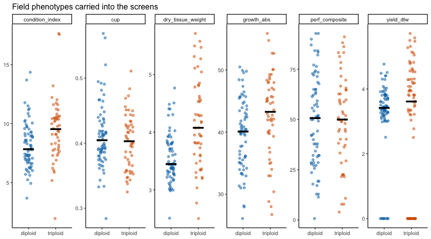<!-- -->

``` r
ggsave(file.path(fig_dir, "field_phenotypes.png"), p_ph, width = 13, height = 4)

phen %>% select(all_of(cont_phen), shell_height, whole_wet_weight, fan) %>%
  cor(use = "pairwise.complete.obs", method = "spearman") %>% round(2) %>%
  kable(caption = "Spearman correlations among field phenotypes (survivors where applicable)")
```

|                     | growth\_abs | condition\_index | dry\_tissue\_weight |   cup | yield\_dtw | perf\_composite | shell\_height | whole\_wet\_weight |   fan |
|---------------------|------------:|-----------------:|--------------------:|------:|-----------:|----------------:|--------------:|-------------------:|------:|
| growth\_abs         |        1.00 |             0.22 |                0.65 | -0.53 |       0.65 |            0.72 |          0.89 |               0.77 | -0.32 |
| condition\_index    |        0.22 |             1.00 |                0.70 |  0.14 |       0.70 |            0.70 |          0.19 |               0.28 | -0.12 |
| dry\_tissue\_weight |        0.65 |             0.70 |                1.00 | -0.12 |       1.00 |            0.74 |          0.68 |               0.77 | -0.24 |
| cup                 |       -0.53 |             0.14 |               -0.12 |  1.00 |      -0.12 |           -0.24 |         -0.55 |              -0.25 |  0.31 |
| yield\_dtw          |        0.65 |             0.70 |                1.00 | -0.12 |       1.00 |            0.74 |          0.54 |               0.77 | -0.24 |
| perf\_composite     |        0.72 |             0.70 |                0.74 | -0.24 |       0.74 |            1.00 |          0.53 |               0.47 | -0.15 |
| shell\_height       |        0.89 |             0.19 |                0.68 | -0.55 |       0.54 |            0.53 |          1.00 |               0.89 | -0.47 |
| whole\_wet\_weight  |        0.77 |             0.28 |                0.77 | -0.25 |       0.77 |            0.47 |          0.89 |               1.00 | -0.33 |
| fan                 |       -0.32 |            -0.12 |               -0.24 |  0.31 |      -0.24 |           -0.15 |         -0.47 |              -0.33 |  1.00 |

Spearman correlations among field phenotypes (survivors where
applicable)

# 6 Join and benchmark covariates

Any resazurin index must beat what is already free: ploidy, assay-time
size, and plate. These are tested here as the reference bar.

``` r
X_df <- as_tibble(X, rownames = "trace_id")
joined <- phen %>% inner_join(X_df, by = "trace_id") %>%
  left_join(features_raw %>% distinct(trace_id, plate, row, col), by = "trace_id")
write_csv(joined, file.path(out_dir, "joined_indices_phenotypes.csv"))
cat("Animals in analysis table:", nrow(joined), "\n")

surv_df <- joined %>% filter(!is.na(survived))
cat("\nSurvival by ploidy (Fisher):\n")
print(table(surv_df$ploidy, ifelse(surv_df$survived == 1, "alive", "dead")))
print(fisher.test(table(surv_df$ploidy, surv_df$survived)))

cat("\nBenchmark logistic models for survival:\n")
b0 <- glm(survived ~ ploidy, family = binomial, data = surv_df)
b1 <- glm(survived ~ ploidy + log(length_mm), family = binomial, data = surv_df)
b2 <- glm(survived ~ ploidy + log(length_mm) + plate, family = binomial, data = surv_df)
print(anova(b0, b1, b2, test = "Chisq"))
cat("\nAssay-time size vs growth (survivors, Spearman by ploidy):\n")
joined %>% filter(survived == 1) %>% group_by(ploidy) %>%
  summarise(rho_len_growth = round(cor(length_mm, growth_abs, method = "spearman"), 3),
            rho_len_CI = round(cor(length_mm, condition_index, method = "spearman", use = "complete.obs"), 3),
            .groups = "drop") %>% print()
```

    Animals in analysis table: 164 

    Survival by ploidy (Fisher):
              
               alive dead
      diploid     71    9
      triploid    52   24

        Fisher's Exact Test for Count Data

    data:  table(surv_df$ploidy, surv_df$survived)
    p-value = 0.002898
    alternative hypothesis: true odds ratio is not equal to 1
    95 percent confidence interval:
     0.1041597 0.6792760
    sample estimates:
    odds ratio 
     0.2769266 


    Benchmark logistic models for survival:
    Analysis of Deviance Table

    Model 1: survived ~ ploidy
    Model 2: survived ~ ploidy + log(length_mm)
    Model 3: survived ~ ploidy + log(length_mm) + plate
      Resid. Df Resid. Dev Df Deviance Pr(>Chi)
    1       154     151.07                     
    2       153     150.65  1  0.41848   0.5177
    3       150     148.69  3  1.95743   0.5813

    Assay-time size vs growth (survivors, Spearman by ploidy):
    # A tibble: 2 x 3
      ploidy   rho_len_growth rho_len_CI
      <chr>             <dbl>      <dbl>
    1 diploid           0.009     -0.155
    2 triploid          0.12      -0.14 

# 7 Screen 1: every index vs survival

For each stratum the association of every index with survival is
measured by the **AUC** (probability a random survivor has a higher
index than a random non-survivor; 0.5 = no information) and by the odds
ratio per 1 SD from a logistic model. Strata:

-   `pooled_adj`: all animals, indices z-scored **within ploidy**,
    ploidy as covariate;
-   `diploid`, `triploid`: within-ploidy only.

Multiplicity: BH q-values within stratum, plus a **permutation
family-wise p**: survival labels are shuffled 1000 times, the largest
\|AUC - 0.5\| across *all* indices is recorded each time, and each
observed index is compared against that null. This is the right
calibration for “the best of several hundred indices”.

``` r
# vectorized AUC for a matrix of indices (NA-tolerant) against binary y
rank_matrix <- function(M) apply(M, 2, function(z) { r <- rep(0, length(z)); ok <- is.finite(z); r[ok] <- rank(z[ok]); r })
auc_vec <- function(R, Mok, y) {
  n1 <- as.vector(crossprod(Mok, y)); n0 <- colSums(Mok) - n1
  S1 <- as.vector(crossprod(R, y))
  (S1 - n1 * (n1 + 1) / 2) / (n1 * n0)
}
zscore_within <- function(M, g) {
  out <- M
  for (lev in unique(g)) { i <- g == lev; out[i, ] <- scale(M[i, , drop = FALSE]) }
  out
}

strata_data <- function(df) {
  Xm <- as.matrix(df[, colnames(X)])
  list(
    pooled_adj = list(X = zscore_within(Xm, df$ploidy), df = df),
    diploid    = list(X = Xm[df$ploidy == "diploid", , drop = FALSE],  df = df[df$ploidy == "diploid", ]),
    triploid   = list(X = Xm[df$ploidy == "triploid", , drop = FALSE], df = df[df$ploidy == "triploid", ])
  )
}

screen_survival_one <- function(Xs, df, stratum) {
  y <- df$survived
  R <- rank_matrix(Xs); Mok <- is.finite(Xs) * 1
  auc <- auc_vec(R, Mok, y)
  # permutation null of the best index
  null_max <- replicate(n_perm, { yp <- sample(y); max(abs(auc_vec(R, Mok, yp) - 0.5), na.rm = TRUE) })
  fw_p <- sapply(abs(auc - 0.5), function(d) mean(null_max >= d))
  # per-index logistic OR per SD and Wald p (ploidy covariate in pooled)
  glm_stats <- map_dfr(seq_len(ncol(Xs)), function(j) {
    z <- as.numeric(scale(Xs[, j])); ok <- is.finite(z)
    if (sum(ok) < 20 || length(unique(y[ok])) < 2) return(tibble(or_per_sd = NA, glm_p = NA, n = sum(ok), n_dead = sum(y[ok] == 0)))
    fit <- tryCatch(
      if (stratum == "pooled_adj") glm(y[ok] ~ z[ok] + df$ploidy[ok], family = binomial)
      else glm(y[ok] ~ z[ok], family = binomial), error = function(e) NULL)
    if (is.null(fit)) return(tibble(or_per_sd = NA, glm_p = NA, n = sum(ok), n_dead = sum(y[ok] == 0)))
    cf <- summary(fit)$coefficients
    tibble(or_per_sd = exp(cf[2, 1]), glm_p = cf[2, 4], n = sum(ok), n_dead = sum(y[ok] == 0))
  })
  mw_p <- sapply(seq_len(ncol(Xs)), function(j) {
    z <- Xs[, j]; ok <- is.finite(z)
    if (length(unique(y[ok])) < 2) return(NA_real_)
    suppressWarnings(wilcox.test(z[ok] ~ y[ok])$p.value)
  })
  tibble(stratum = stratum, index_id = colnames(Xs), auc = auc, rank_biserial = 2 * auc - 1,
         mw_p = mw_p, fw_perm_p = fw_p) %>%
    bind_cols(glm_stats) %>%
    mutate(q_bh = p.adjust(mw_p, method = "BH"),
           null_best_auc_dev_95 = quantile(null_max, 0.95))
}
```

``` r
sd_list <- strata_data(surv_df)
screen_survival <- imap_dfr(sd_list, ~ screen_survival_one(.x$X, .x$df, .y)) %>%
  left_join(index_dictionary %>% select(index_id, scale, feature, adjustment), by = "index_id") %>%
  arrange(stratum, desc(abs(auc - 0.5)))
write_csv(screen_survival, file.path(out_dir, "screen_survival.csv"))

screen_survival %>% group_by(stratum) %>%
  summarise(n_indices = n(), n_dead = first(n_dead),
            best_auc = round(max(auc, na.rm = TRUE), 3), worst_auc = round(min(auc, na.rm = TRUE), 3),
            `95% null best |AUC-0.5|` = round(first(null_best_auc_dev_95), 3),
            n_fw_p_lt_0.05 = sum(fw_perm_p < 0.05, na.rm = TRUE),
            n_q_bh_lt_0.10 = sum(q_bh < 0.10, na.rm = TRUE),
            n_nominal_p_lt_0.05 = sum(mw_p < 0.05, na.rm = TRUE), .groups = "drop") %>%
  kable(caption = "Survival screen summary. The 95% null column is how far from 0.5 the BEST index gets by chance alone.")

screen_survival %>% group_by(stratum) %>% slice_max(abs(auc - 0.5), n = 10, with_ties = FALSE) %>%
  ungroup() %>%
  transmute(stratum, scale, feature, adjustment, n, auc = round(auc, 3),
            or_per_sd = round(or_per_sd, 2), mw_p = signif(mw_p, 2),
            q_bh = signif(q_bh, 2), fw_perm_p = round(fw_perm_p, 3)) %>%
  kable(caption = "Top 10 survival indices per stratum. AUC > 0.5: higher index -> more likely alive.")
```

| stratum     | n\_indices | n\_dead | best\_auc | worst\_auc | 95% null best \|AUC-0.5\| | n\_fw\_p\_lt\_0.05 | n\_q\_bh\_lt\_0.10 | n\_nominal\_p\_lt\_0.05 |
|:------------|-----------:|--------:|----------:|-----------:|--------------------------:|-------------------:|-------------------:|------------------------:|
| diploid     |        284 |       9 |     0.742 |      0.362 |                     0.313 |                  0 |                  0 |                      58 |
| pooled\_adj |        284 |      33 |     0.628 |      0.387 |                     0.179 |                  0 |                  0 |                      11 |
| triploid    |        284 |      24 |     0.631 |      0.379 |                     0.221 |                  0 |                  0 |                       0 |

Survival screen summary. The 95% null column is how far from 0.5 the
BEST index gets by chance alone.

| stratum     | scale          | feature                        | adjustment |   n |   auc | or\_per\_sd | mw\_p | q\_bh | fw\_perm\_p |
|:------------|:---------------|:-------------------------------|:-----------|----:|------:|------------:|------:|------:|------------:|
| diploid     | fc\_corr\_mm   | final\_value                   | resid      |  80 | 0.742 |        2.27 | 0.019 |  0.19 |       0.318 |
| diploid     | fc\_corr\_mm   | mean\_rate                     | resid      |  80 | 0.742 |        2.28 | 0.019 |  0.19 |       0.318 |
| diploid     | fc\_corr\_mm   | peak\_value                    | resid      |  80 | 0.739 |        2.13 | 0.021 |  0.19 |       0.340 |
| diploid     | fc\_corr\_mm   | value\_4h                      | resid      |  80 | 0.737 |        2.22 | 0.021 |  0.19 |       0.348 |
| diploid     | fc\_corr       | peak\_value                    | resid      |  80 | 0.736 |        1.96 | 0.022 |  0.19 |       0.358 |
| diploid     | fc\_corr       | final\_value                   | resid      |  80 | 0.734 |        2.08 | 0.023 |  0.19 |       0.363 |
| diploid     | fc\_corr       | mean\_rate                     | resid      |  80 | 0.734 |        2.08 | 0.023 |  0.19 |       0.363 |
| diploid     | fc\_corr\_mm   | auc\_total                     | resid      |  80 | 0.732 |        2.14 | 0.024 |  0.19 |       0.374 |
| diploid     | fc\_corr       | value\_4h                      | resid      |  80 | 0.731 |        2.04 | 0.025 |  0.19 |       0.381 |
| diploid     | fc\_corr\_mm   | auc\_late                      | resid      |  80 | 0.729 |        2.11 | 0.026 |  0.19 |       0.394 |
| pooled\_adj | raw\_rfu       | n\_negative\_intervals         | none       | 156 | 0.628 |        1.35 | 0.020 |  0.87 |       0.406 |
| pooled\_adj | raw\_rfu       | depression\_abs                | none       | 156 | 0.614 |        1.05 | 0.037 |  0.87 |       0.600 |
| pooled\_adj | raw\_delta\_mm | depression\_abs                | none       | 156 | 0.613 |        1.05 | 0.039 |  0.87 |       0.611 |
| pooled\_adj | raw\_rfu       | metabolic\_depression\_index   | none       | 156 | 0.613 |        1.09 | 0.039 |  0.87 |       0.612 |
| pooled\_adj | raw\_rfu       | resilience\_ratio              | none       | 156 | 0.387 |        0.92 | 0.039 |  0.87 |       0.612 |
| pooled\_adj | raw\_delta     | resilience\_ratio              | none       | 156 | 0.387 |        0.92 | 0.039 |  0.87 |       0.612 |
| pooled\_adj | fc\_corr       | metabolic\_depression\_index   | none       | 156 | 0.613 |        1.09 | 0.039 |  0.87 |       0.612 |
| pooled\_adj | fc\_corr       | resilience\_ratio              | none       | 156 | 0.387 |        0.92 | 0.039 |  0.87 |       0.612 |
| pooled\_adj | fc\_corr\_mm   | depression\_abs                | none       | 156 | 0.613 |        1.02 | 0.039 |  0.87 |       0.612 |
| pooled\_adj | fc\_corr       | depression\_abs                | none       | 156 | 0.613 |        1.03 | 0.040 |  0.87 |       0.620 |
| triploid    | raw\_rfu       | time\_to\_vmax                 | resid      |  76 | 0.631 |        1.41 | 0.069 |  1.00 |       0.772 |
| triploid    | raw\_rfu       | inflection\_time               | none       |  76 | 0.379 |        0.71 | 0.090 |  1.00 |       0.857 |
| triploid    | raw\_rfu       | n\_negative\_intervals         | resid      |  76 | 0.583 |        1.38 | 0.250 |  1.00 |       0.991 |
| triploid    | raw\_rfu       | time\_to\_min\_slope           | none       |  76 | 0.422 |        0.96 | 0.270 |  1.00 |       0.996 |
| triploid    | raw\_rfu       | inflection\_time               | resid      |  76 | 0.427 |        0.79 | 0.310 |  1.00 |       0.998 |
| triploid    | raw\_rfu       | n\_negative\_intervals         | none       |  76 | 0.570 |        1.35 | 0.270 |  1.00 |       1.000 |
| triploid    | raw\_rfu       | baseline\_value                | none       |  76 | 0.570 |        1.39 | 0.330 |  1.00 |       1.000 |
| triploid    | raw\_delta\_mm | vmax                           | none       |  76 | 0.569 |        1.26 | 0.340 |  1.00 |       1.000 |
| triploid    | raw\_rfu       | time\_to\_peak                 | none       |  76 | 0.431 |        0.81 | 0.340 |  1.00 |       1.000 |
| triploid    | fc\_corr       | delta\_auc\_late\_minus\_early | none       |  76 | 0.433 |        0.85 | 0.350 |  1.00 |       1.000 |

Top 10 survival indices per stratum. AUC &gt; 0.5: higher index -&gt;
more likely alive.

``` r
p_surv_rank <- screen_survival %>%
  group_by(stratum) %>% slice_max(abs(auc - 0.5), n = 15, with_ties = FALSE) %>% ungroup() %>%
  mutate(label = paste0(feature, "  [", scale, ifelse(adjustment == "resid", ", resid", ""), "]"),
         sig = case_when(fw_perm_p < 0.05 ~ "family-wise p < 0.05", q_bh < 0.10 ~ "BH q < 0.10",
                         mw_p < 0.05 ~ "nominal p < 0.05", TRUE ~ "n.s.")) %>%
  ggplot(aes(auc, reorder(paste(stratum, label), abs(auc - 0.5)), fill = sig)) +
  geom_col() + geom_vline(xintercept = 0.5) +
  facet_wrap(~ stratum, scales = "free_y", ncol = 1) +
  scale_y_discrete(labels = function(x) str_remove(x, "^[a-z_]+ ")) +
  scale_fill_manual(values = c("family-wise p < 0.05" = "#B2182B", "BH q < 0.10" = "#EF8A62",
                               "nominal p < 0.05" = "#67A9CF", "n.s." = "grey75"), name = NULL) +
  labs(x = "AUC for survival (0.5 = uninformative; >0.5 higher index -> survives)", y = NULL,
       title = "Top 15 resazurin indices for field survival, per stratum") +
  theme_classic(base_size = 9) + theme(legend.position = "bottom")
p_surv_rank
```

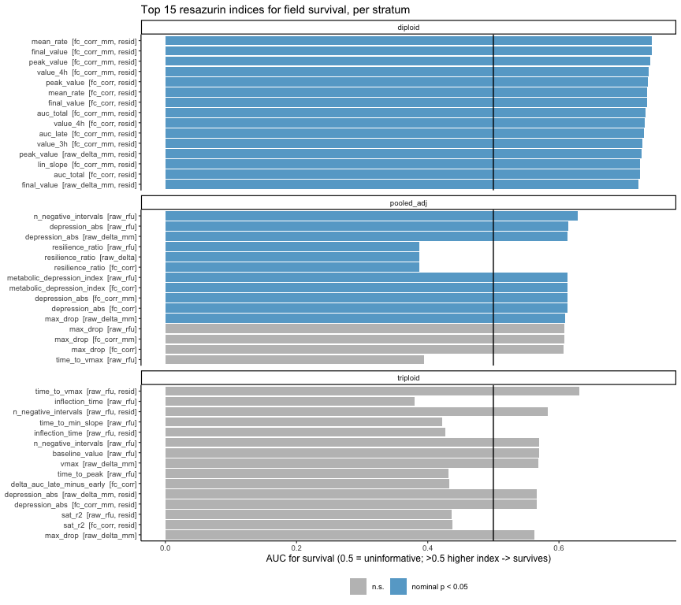<!-- -->

``` r
ggsave(file.path(fig_dir, "survival_index_ranking.png"), p_surv_rank, width = 9, height = 10)
```

``` r
p_null <- screen_survival %>%
  ggplot(aes(abs(auc - 0.5))) +
  geom_histogram(bins = 40, fill = "grey70") +
  geom_vline(aes(xintercept = null_best_auc_dev_95), colour = "#B2182B", linetype = 2) +
  facet_wrap(~ stratum, scales = "free_y") +
  labs(x = "|AUC - 0.5| of every index", y = "Indices",
       title = "Observed survival associations vs the permutation ceiling",
       subtitle = "Dashed: 95th percentile of the BEST index under shuffled survival labels") +
  theme_classic(base_size = 10)
p_null
```

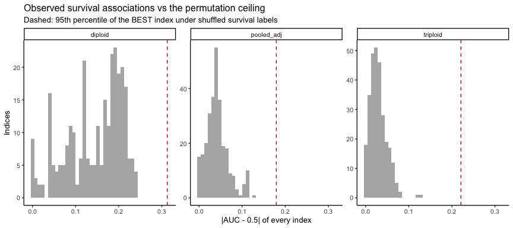<!-- -->

``` r
ggsave(file.path(fig_dir, "survival_permutation_ceiling.png"), p_null, width = 10, height = 4)
```

# 8 Screen 2: every index vs continuous performance

Spearman rho of each index with each continuous phenotype, per stratum,
with BH q within stratum x phenotype and the same permutation
family-wise calibration (labels shuffled, max \|rho\| across indices
recorded).

``` r
screen_cont_one <- function(Xs, df, stratum, phenotype) {
  y <- df[[phenotype]]; ok_y <- is.finite(y)
  Xs <- Xs[ok_y, , drop = FALSE]; y <- y[ok_y]
  if (stratum == "pooled_adj") {           # within-ploidy rank-standardize the phenotype too
    g <- df$ploidy[ok_y]
    y <- ave(y, g, FUN = function(v) as.numeric(scale(rank(v))))
  }
  rho <- suppressWarnings(cor(Xs, y, method = "spearman", use = "pairwise.complete.obs"))[, 1]
  n   <- colSums(is.finite(Xs))
  tval <- rho * sqrt((n - 2) / pmax(1 - rho^2, 1e-12))
  p    <- 2 * pt(abs(tval), df = n - 2, lower.tail = FALSE)
  null_max <- replicate(n_perm, {
    yp <- sample(y)
    max(abs(suppressWarnings(cor(Xs, yp, method = "spearman", use = "pairwise.complete.obs"))), na.rm = TRUE)
  })
  tibble(stratum = stratum, phenotype = phenotype, index_id = colnames(Xs), n = n,
         spearman_rho = rho, p = p, q_bh = p.adjust(p, method = "BH"),
         fw_perm_p = sapply(abs(rho), function(d) mean(null_max >= d)),
         null_best_rho_95 = quantile(null_max, 0.95))
}

sd_all <- strata_data(joined)
screen_continuous <- map_dfr(cont_phen, function(ph)
  imap_dfr(sd_all, ~ screen_cont_one(.x$X, .x$df, .y, ph))) %>%
  left_join(index_dictionary %>% select(index_id, scale, feature, adjustment), by = "index_id") %>%
  arrange(phenotype, stratum, desc(abs(spearman_rho)))
write_csv(screen_continuous, file.path(out_dir, "screen_continuous.csv"))

screen_continuous %>% group_by(phenotype, stratum) %>%
  summarise(n_animals = max(n), best_abs_rho = round(max(abs(spearman_rho), na.rm = TRUE), 3),
            `95% null best |rho|` = round(first(null_best_rho_95), 3),
            n_fw_p_lt_0.05 = sum(fw_perm_p < 0.05, na.rm = TRUE),
            n_q_bh_lt_0.10 = sum(q_bh < 0.10, na.rm = TRUE), .groups = "drop") %>%
  kable(caption = "Continuous-phenotype screen summary")

screen_continuous %>% group_by(phenotype, stratum) %>%
  slice_max(abs(spearman_rho), n = 3, with_ties = FALSE) %>% ungroup() %>%
  transmute(phenotype, stratum, scale, feature, adjustment, n, rho = round(spearman_rho, 3),
            p = signif(p, 2), q_bh = signif(q_bh, 2), fw_perm_p = round(fw_perm_p, 3)) %>%
  kable(caption = "Top 3 indices per phenotype x stratum")
```

| phenotype           | stratum     | n\_animals | best\_abs\_rho | 95% null best \|rho\| | n\_fw\_p\_lt\_0.05 | n\_q\_bh\_lt\_0.10 |
|:--------------------|:------------|-----------:|---------------:|----------------------:|-------------------:|-------------------:|
| condition\_index    | diploid     |         71 |          0.350 |                 0.375 |                  0 |                  0 |
| condition\_index    | pooled\_adj |        123 |          0.160 |                 0.280 |                  0 |                  0 |
| condition\_index    | triploid    |         52 |          0.325 |                 0.441 |                  0 |                  0 |
| cup                 | diploid     |         71 |          0.241 |                 0.367 |                  0 |                  0 |
| cup                 | pooled\_adj |        123 |          0.176 |                 0.279 |                  0 |                  0 |
| cup                 | triploid    |         52 |          0.333 |                 0.445 |                  0 |                  0 |
| dry\_tissue\_weight | diploid     |         71 |          0.244 |                 0.372 |                  0 |                  0 |
| dry\_tissue\_weight | pooled\_adj |        123 |          0.159 |                 0.285 |                  0 |                  0 |
| dry\_tissue\_weight | triploid    |         52 |          0.415 |                 0.446 |                  0 |                  0 |
| growth\_abs         | diploid     |         71 |          0.151 |                 0.366 |                  0 |                  0 |
| growth\_abs         | pooled\_adj |        123 |          0.116 |                 0.284 |                  0 |                  0 |
| growth\_abs         | triploid    |         52 |          0.397 |                 0.443 |                  0 |                  0 |
| perf\_composite     | diploid     |         71 |          0.309 |                 0.376 |                  0 |                  0 |
| perf\_composite     | pooled\_adj |        123 |          0.133 |                 0.285 |                  0 |                  0 |
| perf\_composite     | triploid    |         52 |          0.405 |                 0.433 |                  0 |                  0 |
| yield\_dtw          | diploid     |         80 |          0.227 |                 0.348 |                  0 |                  0 |
| yield\_dtw          | pooled\_adj |        156 |          0.143 |                 0.253 |                  0 |                  0 |
| yield\_dtw          | triploid    |         76 |          0.231 |                 0.363 |                  0 |                  0 |

Continuous-phenotype screen summary

| phenotype           | stratum     | scale          | feature                        | adjustment |   n |    rho |      p | q\_bh | fw\_perm\_p |
|:--------------------|:------------|:---------------|:-------------------------------|:-----------|----:|-------:|-------:|------:|------------:|
| condition\_index    | diploid     | raw\_rfu       | delta\_auc\_late\_minus\_early | none       |  71 | -0.350 | 0.0028 |  0.16 |       0.091 |
| condition\_index    | diploid     | fc\_corr       | delta\_auc\_late\_minus\_early | none       |  71 | -0.344 | 0.0033 |  0.16 |       0.103 |
| condition\_index    | diploid     | raw\_delta\_mm | sat\_asymptote                 | resid      |  70 | -0.342 | 0.0037 |  0.16 |       0.104 |
| condition\_index    | pooled\_adj | fc\_corr       | sat\_r2                        | resid      | 119 |  0.160 | 0.0810 |  0.99 |       0.765 |
| condition\_index    | pooled\_adj | raw\_rfu       | sat\_r2                        | resid      | 119 |  0.160 | 0.0830 |  0.99 |       0.777 |
| condition\_index    | pooled\_adj | fc\_corr       | sat\_r2                        | none       | 119 |  0.138 | 0.1300 |  0.99 |       0.909 |
| condition\_index    | triploid    | fc\_corr\_mm   | delta\_auc\_late\_minus\_early | none       |  52 |  0.325 | 0.0190 |  0.44 |       0.411 |
| condition\_index    | triploid    | raw\_rfu       | inflection\_time               | none       |  52 |  0.311 | 0.0250 |  0.44 |       0.487 |
| condition\_index    | triploid    | raw\_delta\_mm | delta\_auc\_late\_minus\_early | none       |  52 |  0.310 | 0.0250 |  0.44 |       0.492 |
| cup                 | diploid     | raw\_delta\_mm | sat\_asymptote                 | none       |  70 |  0.241 | 0.0440 |  0.62 |       0.570 |
| cup                 | diploid     | raw\_delta\_mm | peak\_value                    | none       |  71 |  0.236 | 0.0470 |  0.62 |       0.601 |
| cup                 | diploid     | raw\_delta\_mm | lin\_slope                     | none       |  71 |  0.236 | 0.0480 |  0.62 |       0.608 |
| cup                 | pooled\_adj | raw\_delta\_mm | sat\_asymptote                 | none       | 119 |  0.176 | 0.0550 |  0.88 |       0.670 |
| cup                 | pooled\_adj | fc\_corr\_mm   | sat\_asymptote                 | none       | 119 |  0.170 | 0.0640 |  0.88 |       0.724 |
| cup                 | pooled\_adj | fc\_corr       | sat\_asymptote                 | resid      | 119 |  0.170 | 0.0650 |  0.88 |       0.726 |
| cup                 | triploid    | raw\_rfu       | baseline\_value                | resid      |  52 | -0.333 | 0.0160 |  0.86 |       0.364 |
| cup                 | triploid    | raw\_rfu       | n\_negative\_intervals         | none       |  52 | -0.312 | 0.0240 |  0.86 |       0.471 |
| cup                 | triploid    | raw\_rfu       | rate\_last\_first\_ratio       | none       |  52 |  0.300 | 0.0310 |  0.86 |       0.523 |
| dry\_tissue\_weight | diploid     | fc\_corr       | rate\_h2                       | none       |  71 | -0.244 | 0.0400 |  0.92 |       0.563 |
| dry\_tissue\_weight | diploid     | raw\_rfu       | rate\_h2                       | none       |  71 | -0.244 | 0.0400 |  0.92 |       0.565 |
| dry\_tissue\_weight | diploid     | fc\_corr\_mm   | rate\_h2                       | none       |  71 | -0.238 | 0.0460 |  0.92 |       0.600 |
| dry\_tissue\_weight | pooled\_adj | raw\_rfu       | baseline\_value                | none       | 123 | -0.159 | 0.0800 |  1.00 |       0.799 |
| dry\_tissue\_weight | pooled\_adj | fc\_corr       | depression\_abs                | none       | 123 |  0.138 | 0.1300 |  1.00 |       0.913 |
| dry\_tissue\_weight | pooled\_adj | raw\_rfu       | depression\_abs                | none       | 123 |  0.137 | 0.1300 |  1.00 |       0.920 |
| dry\_tissue\_weight | triploid    | fc\_corr\_mm   | rate\_h2                       | resid      |  52 |  0.415 | 0.0022 |  0.24 |       0.083 |
| dry\_tissue\_weight | triploid    | fc\_corr       | sat\_asymptote                 | none       |  49 |  0.413 | 0.0032 |  0.24 |       0.091 |
| dry\_tissue\_weight | triploid    | raw\_delta\_mm | rate\_h2                       | resid      |  52 |  0.404 | 0.0030 |  0.24 |       0.108 |
| growth\_abs         | diploid     | fc\_corr\_mm   | sat\_asymptote                 | resid      |  70 | -0.151 | 0.2100 |  0.99 |       0.987 |
| growth\_abs         | diploid     | raw\_rfu       | auc\_0\_1h                     | resid      |  71 |  0.149 | 0.2100 |  0.99 |       0.988 |
| growth\_abs         | diploid     | fc\_corr       | sat\_asymptote                 | resid      |  70 | -0.149 | 0.2200 |  0.99 |       0.988 |
| growth\_abs         | pooled\_adj | fc\_corr       | rate\_last\_first\_ratio       | resid      | 123 | -0.116 | 0.2000 |  0.95 |       0.969 |
| growth\_abs         | pooled\_adj | raw\_rfu       | rate\_last\_first\_ratio       | resid      | 123 | -0.114 | 0.2100 |  0.95 |       0.975 |
| growth\_abs         | pooled\_adj | raw\_rfu       | rate\_last\_first\_ratio       | none       | 123 | -0.112 | 0.2200 |  0.95 |       0.980 |
| growth\_abs         | triploid    | fc\_corr       | sat\_asymptote                 | none       |  49 |  0.397 | 0.0047 |  0.55 |       0.114 |
| growth\_abs         | triploid    | fc\_corr\_mm   | sat\_asymptote                 | none       |  49 |  0.350 | 0.0140 |  0.55 |       0.268 |
| growth\_abs         | triploid    | raw\_rfu       | sat\_k                         | resid      |  49 | -0.338 | 0.0180 |  0.55 |       0.324 |
| perf\_composite     | diploid     | fc\_corr\_mm   | sat\_asymptote                 | resid      |  70 | -0.309 | 0.0091 |  0.32 |       0.229 |
| perf\_composite     | diploid     | fc\_corr       | sat\_asymptote                 | resid      |  70 | -0.301 | 0.0110 |  0.32 |       0.260 |
| perf\_composite     | diploid     | raw\_delta\_mm | sat\_asymptote                 | resid      |  70 | -0.296 | 0.0130 |  0.32 |       0.279 |
| perf\_composite     | pooled\_adj | raw\_rfu       | time\_to\_peak                 | resid      | 123 | -0.133 | 0.1400 |  0.99 |       0.934 |
| perf\_composite     | pooled\_adj | fc\_corr\_mm   | sat\_asymptote                 | resid      | 119 | -0.123 | 0.1800 |  0.99 |       0.965 |
| perf\_composite     | pooled\_adj | raw\_delta\_mm | sat\_asymptote                 | resid      | 119 | -0.121 | 0.1900 |  0.99 |       0.972 |
| perf\_composite     | triploid    | fc\_corr       | sat\_asymptote                 | none       |  49 |  0.405 | 0.0039 |  0.18 |       0.106 |
| perf\_composite     | triploid    | fc\_corr\_mm   | sat\_asymptote                 | none       |  49 |  0.403 | 0.0041 |  0.18 |       0.112 |
| perf\_composite     | triploid    | fc\_corr       | delta\_auc\_late\_minus\_early | none       |  52 |  0.380 | 0.0055 |  0.18 |       0.182 |
| yield\_dtw          | diploid     | fc\_corr       | initial\_slope                 | resid      |  80 |  0.227 | 0.0430 |  1.00 |       0.553 |
| yield\_dtw          | diploid     | fc\_corr       | auc\_0\_1h                     | resid      |  80 |  0.227 | 0.0430 |  1.00 |       0.553 |
| yield\_dtw          | diploid     | fc\_corr\_mm   | initial\_slope                 | resid      |  80 |  0.213 | 0.0580 |  1.00 |       0.656 |
| yield\_dtw          | pooled\_adj | raw\_rfu       | vmax                           | none       | 156 |  0.143 | 0.0760 |  0.74 |       0.768 |
| yield\_dtw          | pooled\_adj | raw\_rfu       | n\_negative\_intervals         | none       | 156 |  0.140 | 0.0820 |  0.74 |       0.790 |
| yield\_dtw          | pooled\_adj | raw\_rfu       | n\_negative\_intervals         | resid      | 156 |  0.136 | 0.0910 |  0.74 |       0.823 |
| yield\_dtw          | triploid    | raw\_rfu       | time\_to\_vmax                 | resid      |  76 |  0.231 | 0.0440 |  0.88 |       0.631 |
| yield\_dtw          | triploid    | fc\_corr       | depression\_abs                | none       |  76 |  0.216 | 0.0610 |  0.88 |       0.742 |
| yield\_dtw          | triploid    | raw\_rfu       | depression\_abs                | none       |  76 |  0.215 | 0.0620 |  0.88 |       0.746 |

Top 3 indices per phenotype x stratum

``` r
# unified association heatmap: rank-biserial (2*AUC-1) for survival, Spearman rho for the rest
assoc <- bind_rows(
  screen_survival %>% transmute(stratum, phenotype = "survived", index_id, assoc = rank_biserial, fw_perm_p, q_bh),
  screen_continuous %>% transmute(stratum, phenotype, index_id, assoc = spearman_rho, fw_perm_p, q_bh)
) %>% left_join(index_dictionary %>% select(index_id, scale, feature, adjustment), by = "index_id")

top_idx <- assoc %>% filter(stratum == "pooled_adj") %>% group_by(index_id) %>%
  summarise(m = max(abs(assoc), na.rm = TRUE), .groups = "drop") %>% slice_max(m, n = 30) %>% pull(index_id)

p_heat <- assoc %>% filter(index_id %in% top_idx) %>%
  mutate(label = paste0(feature, " [", scale, ifelse(adjustment == "resid", ", resid", ""), "]"),
         star = case_when(fw_perm_p < 0.05 ~ "**", q_bh < 0.10 ~ "*", TRUE ~ ""),
         phenotype = factor(phenotype, levels = c("survived", cont_phen))) %>%
  ggplot(aes(phenotype, reorder(label, abs(assoc)), fill = assoc)) +
  geom_tile(colour = "white") + geom_text(aes(label = star), size = 3) +
  facet_wrap(~ stratum) +
  scale_fill_gradient2(low = "#2166AC", mid = "white", high = "#B2182B", limits = c(-0.6, 0.6),
                       oob = scales::squish, name = "Association\n(rho or 2AUC-1)") +
  labs(x = NULL, y = NULL, title = "Top 30 indices (by pooled association) across all field phenotypes",
       caption = "** permutation family-wise p < 0.05   * BH q < 0.10") +
  theme_classic(base_size = 9) + theme(axis.text.x = element_text(angle = 45, hjust = 1))
p_heat
```

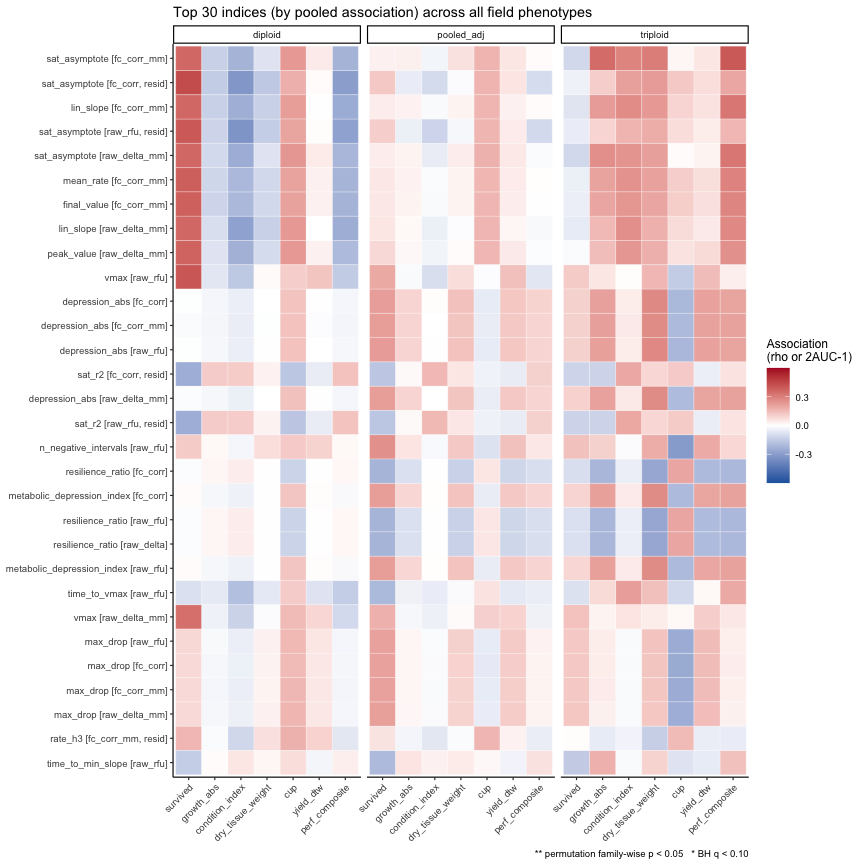<!-- -->

``` r
ggsave(file.path(fig_dir, "association_heatmap_top_indices.png"), p_heat, width = 13, height = 9)
```

# 9 Which normalization works best?

``` r
scale_comparison <- assoc %>%
  group_by(stratum, phenotype, scale, adjustment) %>%
  slice_max(abs(assoc), n = 1, with_ties = FALSE) %>% ungroup() %>%
  transmute(stratum, phenotype, scale, adjustment, best_feature = feature,
            best_assoc = assoc, fw_perm_p, q_bh)
write_csv(scale_comparison, file.path(out_dir, "scale_comparison.csv"))

p_scale <- scale_comparison %>%
  filter(phenotype %in% c("survived", "growth_abs", "condition_index", "yield_dtw")) %>%
  mutate(scale = factor(scale, levels = scale_levels)) %>%
  ggplot(aes(scale, abs(best_assoc), colour = adjustment, shape = adjustment)) +
  geom_point(size = 2.5, position = position_dodge(width = 0.5)) +
  facet_grid(phenotype ~ stratum) +
  scale_colour_manual(values = c(none = "grey30", resid = "#009E73")) +
  labs(x = "Value scale", y = "|best association| within scale",
       title = "Best single-index association by value scale and size/plate adjustment") +
  theme_classic(base_size = 9) + theme(axis.text.x = element_text(angle = 40, hjust = 1))
p_scale
```

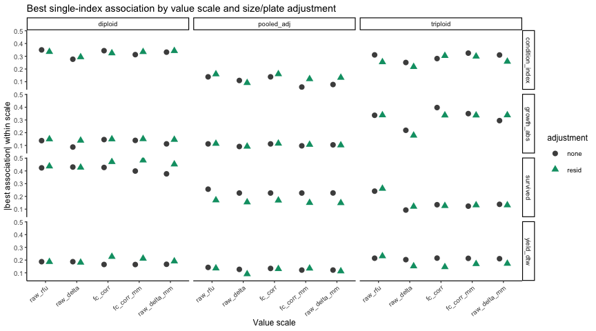<!-- -->

``` r
ggsave(file.path(fig_dir, "scale_comparison.png"), p_scale, width = 11, height = 7)
```

# 10 How long does the assay need to run?

Window indices (`value_1h`, `auc_0_1h`, …) answer whether a 1-, 2- or
3-hour read would predict as well as the full 4 hours. Compared here on
the two scales most likely to be used in practice.

``` r
window_feats <- tibble(
  feature = c("value_1h", "value_2h", "value_3h", "value_4h", "auc_0_1h", "auc_0_2h", "auc_0_3h", "auc_total"),
  hours   = c(1, 2, 3, 4, 1, 2, 3, 4),
  kind    = rep(c("value at t", "AUC to t"), each = 4))

assay_duration <- assoc %>%
  filter(feature %in% window_feats$feature, phenotype %in% c("survived", "growth_abs", "yield_dtw")) %>%
  inner_join(window_feats, by = "feature")
write_csv(assay_duration, file.path(out_dir, "assay_duration.csv"))

p_dur <- assay_duration %>%
  filter(scale %in% c("fc_corr_mm", "raw_delta"), adjustment == "none") %>%
  ggplot(aes(hours, assoc, colour = scale, linetype = kind)) +
  geom_hline(yintercept = 0, colour = "grey60") +
  geom_line() + geom_point() +
  facet_grid(phenotype ~ stratum) +
  labs(x = "Assay duration used (h)", y = "Association (rho, or 2AUC-1 for survival)",
       title = "Predictive value as a function of assay duration") +
  theme_classic(base_size = 9)
p_dur
```

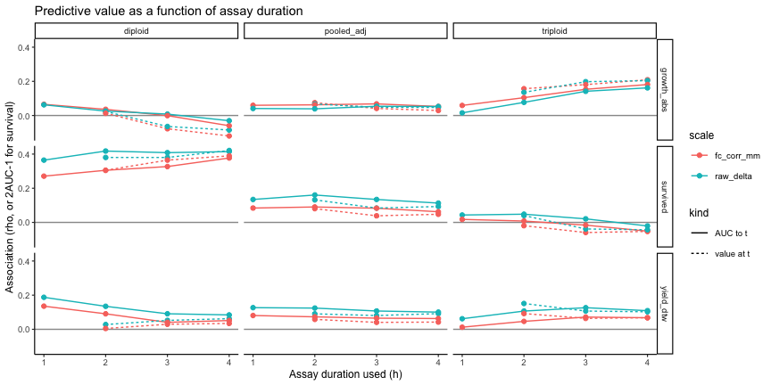<!-- -->

``` r
ggsave(file.path(fig_dir, "assay_duration.png"), p_dur, width = 11, height = 6)
```

# 11 Cross-validation machinery

Leave-one-out CV is avoided here on purpose: when a predictor carries
little signal, LOO predictions become *anti*-correlated with the outcome
(the training mean shifts against the held-out animal), so LOO AUC drops
well below 0.5 for null models and understates weak real signals.
Instead every out-of-sample estimate below uses **10-fold CV stratified
by outcome and ploidy, repeated 10 times**; scores are averaged over
repeats and their SD across repeats is reported.

``` r
make_folds <- function(strat, k) {
  fold <- integer(length(strat))
  for (s in unique(strat)) {
    idx <- which(strat == s); idx <- idx[sample.int(length(idx))]
    fold[idx] <- rep_len(sample.int(k), length(idx))   # balanced within stratum
  }
  fold
}
strat_var <- function(y, ploidy, binary) {
  if (binary) paste(ploidy, y) else paste(ploidy, ave(y, ploidy, FUN = function(v) ntile(v, 4)))
}
score_pred <- function(pred, y, binary) {
  if (binary) { R <- rank(pred); n1 <- sum(y == 1); n0 <- length(y) - n1
    tibble(metric = c("cv_auc", "cv_brier"), value = c((sum(R[y == 1]) - n1 * (n1 + 1) / 2) / (n1 * n0), mean((pred - y)^2)))
  } else tibble(metric = c("cv_spearman", "cv_rmse"),
                value = c(suppressWarnings(cor(pred, y, method = "spearman")), sqrt(mean((pred - y)^2))))
}
# predict_fold(train_idx, test_idx) must return predictions for test_idx
repeated_cv <- function(y, ploidy, binary, predict_fold, k = cv_k, R = cv_repeats) {
  n <- length(y); pred_mat <- matrix(NA_real_, n, R); sc <- vector("list", R)
  strat <- strat_var(y, ploidy, binary)
  for (r in seq_len(R)) {
    fold <- make_folds(strat, k)
    for (f in seq_len(k)) { te <- which(fold == f); tr <- which(fold != f); pred_mat[te, r] <- predict_fold(tr, te) }
    sc[[r]] <- score_pred(pred_mat[, r], y, binary)
  }
  scores <- bind_rows(sc) %>% group_by(metric) %>% summarise(mean = mean(value), sd = sd(value), .groups = "drop")
  list(pred = rowMeans(pred_mat), scores = scores)
}
scores_wide <- function(sc) bind_cols(
  sc %>% select(metric, mean) %>% pivot_wider(names_from = metric, values_from = mean),
  sc %>% transmute(metric = paste0(metric, "_sd"), sd) %>% pivot_wider(names_from = metric, values_from = sd))
```

# 12 Cross-validated prediction from the top single indices

``` r
single_index_cv <- function(x, y, ploidy, binary, pooled) {
  ok <- is.finite(x) & is.finite(y)
  d <- data.frame(y = y[ok], x = x[ok], pl = ploidy[ok])
  fml <- if (pooled) y ~ x + pl else y ~ x
  pf <- function(tr, te) {
    fit <- if (binary) glm(fml, family = binomial, data = d[tr, ]) else lm(fml, data = d[tr, ])
    predict(fit, newdata = d[te, ], type = "response")
  }
  r <- repeated_cv(d$y, d$pl, binary, pf)
  bind_cols(tibble(n = nrow(d)), scores_wide(r$scores))
}

cv_surv <- screen_survival %>% group_by(stratum) %>%
  slice_max(abs(auc - 0.5), n = loo_top_n, with_ties = FALSE) %>% ungroup() %>%
  select(stratum, index_id, scale, feature, adjustment, auc) %>%
  mutate(res = map2(stratum, index_id, function(s, id) {
    d <- sd_list[[s]]; single_index_cv(d$X[, id], d$df$survived, d$df$ploidy, TRUE, s == "pooled_adj")
  })) %>% unnest(res) %>% mutate(phenotype = "survived")

cv_cont <- screen_continuous %>% filter(phenotype %in% c("growth_abs", "condition_index", "yield_dtw")) %>%
  group_by(stratum, phenotype) %>% slice_max(abs(spearman_rho), n = 3, with_ties = FALSE) %>% ungroup() %>%
  select(stratum, phenotype, index_id, scale, feature, adjustment, spearman_rho) %>%
  mutate(res = pmap(list(stratum, index_id, phenotype), function(s, id, ph) {
    d <- sd_all[[s]]; single_index_cv(d$X[, id], d$df[[ph]], d$df$ploidy, FALSE, s == "pooled_adj")
  })) %>% unnest(res)

cv_single <- bind_rows(cv_surv, cv_cont)
write_csv(cv_single, file.path(out_dir, "cv_single_index.csv"))

cv_surv %>% transmute(stratum, scale, feature, adjustment, n, in_sample_auc = round(auc, 3),
                      cv_auc = round(cv_auc, 3), cv_auc_sd = round(cv_auc_sd, 3), cv_brier = round(cv_brier, 3)) %>%
  kable(caption = "Repeated stratified 10-fold CV of top single indices for survival")
cv_cont %>% transmute(phenotype, stratum, scale, feature, adjustment, n, in_sample_rho = round(spearman_rho, 3),
                      cv_spearman = round(cv_spearman, 3), cv_spearman_sd = round(cv_spearman_sd, 3), cv_rmse = round(cv_rmse, 3)) %>%
  kable(caption = "Repeated stratified 10-fold CV of top single indices for continuous phenotypes")
```

| stratum     | scale          | feature                      | adjustment |   n | in\_sample\_auc | cv\_auc | cv\_auc\_sd | cv\_brier |
|:------------|:---------------|:-----------------------------|:-----------|----:|----------------:|--------:|------------:|----------:|
| diploid     | fc\_corr\_mm   | final\_value                 | resid      |  80 |           0.742 |   0.719 |       0.007 |     0.097 |
| diploid     | fc\_corr\_mm   | mean\_rate                   | resid      |  80 |           0.742 |   0.718 |       0.006 |     0.100 |
| diploid     | fc\_corr\_mm   | peak\_value                  | resid      |  80 |           0.739 |   0.722 |       0.008 |     0.097 |
| diploid     | fc\_corr\_mm   | value\_4h                    | resid      |  80 |           0.737 |   0.719 |       0.008 |     0.097 |
| diploid     | fc\_corr       | peak\_value                  | resid      |  80 |           0.736 |   0.708 |       0.011 |     0.102 |
| diploid     | fc\_corr       | final\_value                 | resid      |  80 |           0.734 |   0.714 |       0.009 |     0.101 |
| pooled\_adj | raw\_rfu       | n\_negative\_intervals       | none       | 156 |           0.628 |   0.644 |       0.006 |     0.157 |
| pooled\_adj | raw\_rfu       | depression\_abs              | none       | 156 |           0.614 |   0.594 |       0.019 |     0.160 |
| pooled\_adj | raw\_delta\_mm | depression\_abs              | none       | 156 |           0.613 |   0.608 |       0.014 |     0.159 |
| pooled\_adj | raw\_rfu       | metabolic\_depression\_index | none       | 156 |           0.613 |   0.618 |       0.019 |     0.159 |
| pooled\_adj | raw\_rfu       | resilience\_ratio            | none       | 156 |           0.387 |   0.609 |       0.019 |     0.160 |
| pooled\_adj | raw\_delta     | resilience\_ratio            | none       | 156 |           0.387 |   0.620 |       0.015 |     0.159 |
| triploid    | raw\_rfu       | time\_to\_vmax               | resid      |  76 |           0.631 |   0.599 |       0.020 |     0.218 |
| triploid    | raw\_rfu       | inflection\_time             | none       |  76 |           0.379 |   0.521 |       0.027 |     0.216 |
| triploid    | raw\_rfu       | n\_negative\_intervals       | resid      |  76 |           0.583 |   0.491 |       0.040 |     0.220 |
| triploid    | raw\_rfu       | time\_to\_min\_slope         | none       |  76 |           0.422 |   0.301 |       0.031 |     0.224 |
| triploid    | raw\_rfu       | inflection\_time             | resid      |  76 |           0.427 |   0.514 |       0.020 |     0.219 |
| triploid    | raw\_rfu       | n\_negative\_intervals       | none       |  76 |           0.570 |   0.490 |       0.016 |     0.218 |

Repeated stratified 10-fold CV of top single indices for survival

| phenotype        | stratum     | scale          | feature                        | adjustment |   n | in\_sample\_rho | cv\_spearman | cv\_spearman\_sd | cv\_rmse |
|:-----------------|:------------|:---------------|:-------------------------------|:-----------|----:|----------------:|-------------:|-----------------:|---------:|
| condition\_index | diploid     | raw\_rfu       | delta\_auc\_late\_minus\_early | none       |  71 |          -0.350 |        0.310 |            0.012 |    1.872 |
| condition\_index | diploid     | fc\_corr       | delta\_auc\_late\_minus\_early | none       |  71 |          -0.344 |        0.309 |            0.016 |    1.870 |
| condition\_index | diploid     | raw\_delta\_mm | sat\_asymptote                 | resid      |  70 |          -0.342 |        0.305 |            0.009 |    1.681 |
| growth\_abs      | diploid     | fc\_corr\_mm   | sat\_asymptote                 | resid      |  70 |          -0.151 |        0.125 |            0.019 |    5.572 |
| growth\_abs      | diploid     | raw\_rfu       | auc\_0\_1h                     | resid      |  71 |           0.149 |        0.073 |            0.041 |    5.761 |
| growth\_abs      | diploid     | fc\_corr       | sat\_asymptote                 | resid      |  70 |          -0.149 |        0.130 |            0.013 |    5.584 |
| yield\_dtw       | diploid     | fc\_corr       | initial\_slope                 | resid      |  80 |           0.227 |        0.188 |            0.020 |    1.198 |
| yield\_dtw       | diploid     | fc\_corr       | auc\_0\_1h                     | resid      |  80 |           0.227 |        0.190 |            0.019 |    1.196 |
| yield\_dtw       | diploid     | fc\_corr\_mm   | initial\_slope                 | resid      |  80 |           0.213 |        0.197 |            0.018 |    1.191 |
| condition\_index | pooled\_adj | fc\_corr       | sat\_r2                        | resid      | 119 |           0.160 |        0.286 |            0.010 |    2.056 |
| condition\_index | pooled\_adj | raw\_rfu       | sat\_r2                        | resid      | 119 |           0.160 |        0.283 |            0.014 |    2.057 |
| condition\_index | pooled\_adj | fc\_corr       | sat\_r2                        | none       | 119 |           0.138 |        0.272 |            0.011 |    2.061 |
| growth\_abs      | pooled\_adj | fc\_corr       | rate\_last\_first\_ratio       | resid      | 123 |          -0.116 |        0.100 |            0.028 |    6.248 |
| growth\_abs      | pooled\_adj | raw\_rfu       | rate\_last\_first\_ratio       | resid      | 123 |          -0.114 |        0.067 |            0.034 |    6.273 |
| growth\_abs      | pooled\_adj | raw\_rfu       | rate\_last\_first\_ratio       | none       | 123 |          -0.112 |        0.084 |            0.018 |    6.240 |
| yield\_dtw       | pooled\_adj | raw\_rfu       | vmax                           | none       | 156 |           0.143 |        0.022 |            0.014 |    1.656 |
| yield\_dtw       | pooled\_adj | raw\_rfu       | n\_negative\_intervals         | none       | 156 |           0.140 |        0.006 |            0.021 |    1.655 |
| yield\_dtw       | pooled\_adj | raw\_rfu       | n\_negative\_intervals         | resid      | 156 |           0.136 |        0.022 |            0.017 |    1.653 |
| condition\_index | triploid    | fc\_corr\_mm   | delta\_auc\_late\_minus\_early | none       |  52 |           0.325 |        0.284 |            0.014 |    2.485 |
| condition\_index | triploid    | raw\_rfu       | inflection\_time               | none       |  52 |           0.311 |        0.125 |            0.032 |    2.535 |
| condition\_index | triploid    | raw\_delta\_mm | delta\_auc\_late\_minus\_early | none       |  52 |           0.310 |        0.254 |            0.023 |    2.506 |
| growth\_abs      | triploid    | fc\_corr       | sat\_asymptote                 | none       |  49 |           0.397 |        0.286 |            0.045 |    6.896 |
| growth\_abs      | triploid    | fc\_corr\_mm   | sat\_asymptote                 | none       |  49 |           0.350 |        0.161 |            0.055 |    6.878 |
| growth\_abs      | triploid    | raw\_rfu       | sat\_k                         | resid      |  49 |          -0.338 |        0.277 |            0.018 |    6.482 |
| yield\_dtw       | triploid    | raw\_rfu       | time\_to\_vmax                 | resid      |  76 |           0.231 |        0.134 |            0.036 |    2.047 |
| yield\_dtw       | triploid    | fc\_corr       | depression\_abs                | none       |  76 |           0.216 |        0.069 |            0.046 |    2.075 |
| yield\_dtw       | triploid    | raw\_rfu       | depression\_abs                | none       |  76 |           0.215 |        0.080 |            0.033 |    2.062 |

Repeated stratified 10-fold CV of top single indices for continuous
phenotypes

# 13 Nested cross-validated composite indices

A composite is built **inside** each CV fold: rank all eligible indices
on the training animals, take the top *k*, sign-align and z-score them
using training statistics, average, fit
`outcome ~ composite (+ ploidy)`, and predict the held-out fold. Feature
selection therefore never sees the animals it is evaluated on. Three
index families are tried:

-   `all`: every unique index (both adjustments);
-   `fc_corr_mm_none`: only the scale the existing pipeline already
    produces;
-   `short_assay_2h`: only indices computable from reads at 0, 1 and 2 h
    (`value_1h`, `value_2h`, `auc_0_1h`, `auc_0_2h`, `rate_h1`,
    `rate_h2`, `initial_slope`, `baseline_value`) on any scale.

Benchmarks: `ploidy` only, and `ploidy + log(assay length) + plate`.

``` r
short_feats <- c("value_1h", "value_2h", "auc_0_1h", "auc_0_2h", "rate_h1", "rate_h2", "initial_slope", "baseline_value")
families <- list(
  all             = index_dictionary$index_id,
  fc_corr_mm_none = index_dictionary %>% filter(scale == "fc_corr_mm", adjustment == "none") %>% pull(index_id),
  short_assay_2h  = index_dictionary %>% filter(feature %in% short_feats) %>% pull(index_id)
)

# Median imputation of the (few) missing index values uses index medians only,
# never a field outcome, so it is done once rather than inside each fold.
median_impute <- function(M) {
  med <- apply(M, 2, median, na.rm = TRUE)
  for (j in seq_len(ncol(M))) M[!is.finite(M[, j]), j] <- med[j]
  M
}

nested_composite <- function(Xs, y, ploidy, k_top, binary, family_ids) {
  keep <- family_ids[colMeans(is.finite(Xs[, family_ids, drop = FALSE])) >= min_completeness]
  ok <- is.finite(y)
  Xs <- median_impute(Xs[ok, keep, drop = FALSE]); y <- y[ok]; pl <- ploidy[ok]
  pooled <- length(unique(pl)) > 1
  chosen <- character(0)
  pf <- function(tr, te) {
    Xtr <- Xs[tr, , drop = FALSE]
    a <- if (binary) auc_vec(rank_matrix(Xtr), matrix(1, nrow(Xtr), ncol(Xtr)), y[tr]) - 0.5
         else suppressWarnings(cor(Xtr, y[tr], method = "spearman"))[, 1]
    a[!is.finite(a)] <- 0
    top <- order(-abs(a))[seq_len(min(k_top, length(a)))]
    chosen <<- c(chosen, colnames(Xs)[top])
    mu <- colMeans(Xtr[, top, drop = FALSE]); sdv <- apply(Xtr[, top, drop = FALSE], 2, sd); sdv[sdv == 0] <- 1
    comp <- function(M) as.vector(sweep(sweep(M[, top, drop = FALSE], 2, mu), 2, sdv, "/") %*% sign(a[top])) / length(top)
    d_tr <- data.frame(y = y[tr], comp = comp(Xtr), pl = pl[tr])
    d_te <- data.frame(comp = comp(Xs[te, , drop = FALSE]), pl = pl[te])
    fml <- if (pooled) y ~ comp + pl else y ~ comp
    fit <- if (binary) glm(fml, family = binomial, data = d_tr) else lm(fml, data = d_tr)
    predict(fit, newdata = d_te, type = "response")
  }
  r <- repeated_cv(y, pl, binary, pf)
  list(pred = r$pred, y = y, ploidy = pl, scores = r$scores, ok = ok,
       selection = table(chosen) / (cv_k * cv_repeats))
}

benchmark_cv <- function(df, y, binary, rhs) {
  ok <- is.finite(y); d <- df[ok, ]; d$y <- y[ok]
  fml <- as.formula(paste("y ~", rhs))
  pf <- function(tr, te) {
    fit <- if (binary) glm(fml, family = binomial, data = d[tr, ]) else lm(fml, data = d[tr, ])
    predict(fit, newdata = d[te, ], type = "response")
  }
  repeated_cv(d$y, d$pl, binary, pf)
}

targets <- tribble(~phenotype, ~binary, "survived", TRUE, "growth_abs", FALSE, "condition_index", FALSE, "yield_dtw", FALSE)
strata_names <- c("pooled_adj", "diploid", "triploid")

composite_runs <- list(); selection_runs <- list(); composite_preds <- list()
for (ph in targets$phenotype) {
  binary <- targets$binary[targets$phenotype == ph]
  for (s in strata_names) {
    d <- sd_all[[s]]; y <- d$df[[ph]]; pl <- d$df$ploidy
    b_df <- data.frame(pl = pl, loglen = log(d$df$length_mm), plate = d$df$plate)
    for (bm in c("ploidy_only", "ploidy_size_plate")) {
      rhs <- if (bm == "ploidy_only") (if (s == "pooled_adj") "pl" else "1") else (if (s == "pooled_adj") "pl + loglen + plate" else "loglen + plate")
      bp <- benchmark_cv(b_df, y, binary, rhs)
      composite_runs[[length(composite_runs) + 1]] <- scores_wide(bp$scores) %>%
        mutate(phenotype = ph, stratum = s, model = bm, family = "benchmark", k = NA_integer_, n = sum(is.finite(y)))
    }
    for (fam in names(families)) for (k in composite_k) {
      r <- nested_composite(d$X, y, pl, k, binary, families[[fam]])
      composite_runs[[length(composite_runs) + 1]] <- scores_wide(r$scores) %>%
        mutate(phenotype = ph, stratum = s, model = paste0("composite_k", k), family = fam, k = k, n = length(r$y))
      selection_runs[[length(selection_runs) + 1]] <- tibble(index_id = names(r$selection),
                                                             selection_freq = as.numeric(r$selection),
                                                             phenotype = ph, stratum = s, family = fam, k = k)
      composite_preds[[paste(ph, s, fam, k)]] <- tibble(phenotype = ph, stratum = s, family = fam, k = k,
                                                       trace_id = d$df$trace_id[r$ok], pred = r$pred, y = r$y, ploidy = r$ploidy)
    }
  }
}
nested_composite_cv <- bind_rows(composite_runs) %>%
  select(phenotype, stratum, family, model, k, n, everything()) %>%
  arrange(phenotype, stratum, family, k)
write_csv(nested_composite_cv, file.path(out_dir, "nested_composite_cv.csv"))
nested_selection <- bind_rows(selection_runs) %>%
  left_join(index_dictionary %>% select(index_id, scale, feature, adjustment), by = "index_id") %>%
  arrange(phenotype, stratum, family, k, desc(selection_freq))
write_csv(nested_selection, file.path(out_dir, "nested_composite_selection.csv"))

nested_composite_cv %>% filter(phenotype == "survived") %>%
  transmute(stratum, family, model, n, cv_auc = round(cv_auc, 3), cv_auc_sd = round(cv_auc_sd, 3), cv_brier = round(cv_brier, 3)) %>%
  kable(caption = "Nested-CV survival prediction: composites vs benchmarks (mean and SD over repeats)")
nested_composite_cv %>% filter(phenotype != "survived") %>%
  transmute(phenotype, stratum, family, model, n, cv_spearman = round(cv_spearman, 3),
            cv_spearman_sd = round(cv_spearman_sd, 3), cv_rmse = round(cv_rmse, 2)) %>%
  kable(caption = "Nested-CV continuous prediction: composites vs benchmarks")
```

| stratum     | family             | model               |   n | cv\_auc | cv\_auc\_sd | cv\_brier |
|:------------|:-------------------|:--------------------|----:|--------:|------------:|----------:|
| diploid     | all                | composite\_k3       |  80 |   0.615 |       0.039 |     0.104 |
| diploid     | all                | composite\_k5       |  80 |   0.641 |       0.032 |     0.102 |
| diploid     | all                | composite\_k8       |  80 |   0.672 |       0.019 |     0.104 |
| diploid     | benchmark          | ploidy\_only        |  80 |   0.444 |       0.000 |     0.100 |
| diploid     | benchmark          | ploidy\_size\_plate |  80 |   0.425 |       0.013 |     0.113 |
| diploid     | fc\_corr\_mm\_none | composite\_k3       |  80 |   0.640 |       0.021 |     0.101 |
| diploid     | fc\_corr\_mm\_none | composite\_k5       |  80 |   0.657 |       0.006 |     0.100 |
| diploid     | fc\_corr\_mm\_none | composite\_k8       |  80 |   0.646 |       0.008 |     0.100 |
| diploid     | short\_assay\_2h   | composite\_k3       |  80 |   0.608 |       0.015 |     0.103 |
| diploid     | short\_assay\_2h   | composite\_k5       |  80 |   0.599 |       0.015 |     0.102 |
| diploid     | short\_assay\_2h   | composite\_k8       |  80 |   0.581 |       0.016 |     0.104 |
| pooled\_adj | all                | composite\_k3       | 156 |   0.603 |       0.020 |     0.165 |
| pooled\_adj | all                | composite\_k5       | 156 |   0.606 |       0.017 |     0.164 |
| pooled\_adj | all                | composite\_k8       | 156 |   0.617 |       0.016 |     0.162 |
| pooled\_adj | benchmark          | ploidy\_only        | 156 |   0.626 |       0.002 |     0.157 |
| pooled\_adj | benchmark          | ploidy\_size\_plate | 156 |   0.619 |       0.012 |     0.164 |
| pooled\_adj | fc\_corr\_mm\_none | composite\_k3       | 156 |   0.666 |       0.010 |     0.158 |
| pooled\_adj | fc\_corr\_mm\_none | composite\_k5       | 156 |   0.658 |       0.007 |     0.160 |
| pooled\_adj | fc\_corr\_mm\_none | composite\_k8       | 156 |   0.648 |       0.019 |     0.161 |
| pooled\_adj | short\_assay\_2h   | composite\_k3       | 156 |   0.663 |       0.003 |     0.160 |
| pooled\_adj | short\_assay\_2h   | composite\_k5       | 156 |   0.657 |       0.010 |     0.161 |
| pooled\_adj | short\_assay\_2h   | composite\_k8       | 156 |   0.660 |       0.009 |     0.160 |
| triploid    | all                | composite\_k3       |  76 |   0.374 |       0.067 |     0.259 |
| triploid    | all                | composite\_k5       |  76 |   0.332 |       0.035 |     0.267 |
| triploid    | all                | composite\_k8       |  76 |   0.315 |       0.052 |     0.262 |
| triploid    | benchmark          | ploidy\_only        |  76 |   0.443 |       0.004 |     0.217 |
| triploid    | benchmark          | ploidy\_size\_plate |  76 |   0.396 |       0.035 |     0.237 |
| triploid    | fc\_corr\_mm\_none | composite\_k3       |  76 |   0.331 |       0.032 |     0.241 |
| triploid    | fc\_corr\_mm\_none | composite\_k5       |  76 |   0.386 |       0.048 |     0.234 |
| triploid    | fc\_corr\_mm\_none | composite\_k8       |  76 |   0.346 |       0.047 |     0.235 |
| triploid    | short\_assay\_2h   | composite\_k3       |  76 |   0.306 |       0.047 |     0.240 |
| triploid    | short\_assay\_2h   | composite\_k5       |  76 |   0.288 |       0.051 |     0.238 |
| triploid    | short\_assay\_2h   | composite\_k8       |  76 |   0.298 |       0.053 |     0.236 |

Nested-CV survival prediction: composites vs benchmarks (mean and SD
over repeats)

| phenotype        | stratum     | family             | model               |   n | cv\_spearman | cv\_spearman\_sd | cv\_rmse |
|:-----------------|:------------|:-------------------|:--------------------|----:|-------------:|-----------------:|---------:|
| condition\_index | diploid     | all                | composite\_k3       |  71 |        0.153 |            0.049 |     1.97 |
| condition\_index | diploid     | all                | composite\_k5       |  71 |        0.163 |            0.053 |     1.96 |
| condition\_index | diploid     | all                | composite\_k8       |  71 |        0.169 |            0.047 |     1.95 |
| condition\_index | diploid     | benchmark          | ploidy\_only        |  71 |       -0.128 |            0.045 |     1.95 |
| condition\_index | diploid     | benchmark          | ploidy\_size\_plate |  71 |       -0.057 |            0.048 |     2.04 |
| condition\_index | diploid     | fc\_corr\_mm\_none | composite\_k3       |  71 |        0.182 |            0.031 |     1.94 |
| condition\_index | diploid     | fc\_corr\_mm\_none | composite\_k5       |  71 |        0.193 |            0.033 |     1.93 |
| condition\_index | diploid     | fc\_corr\_mm\_none | composite\_k8       |  71 |        0.201 |            0.017 |     1.92 |
| condition\_index | diploid     | short\_assay\_2h   | composite\_k3       |  71 |        0.181 |            0.028 |     1.93 |
| condition\_index | diploid     | short\_assay\_2h   | composite\_k5       |  71 |        0.190 |            0.024 |     1.93 |
| condition\_index | diploid     | short\_assay\_2h   | composite\_k8       |  71 |        0.165 |            0.028 |     1.93 |
| condition\_index | pooled\_adj | all                | composite\_k3       | 123 |        0.128 |            0.030 |     2.35 |
| condition\_index | pooled\_adj | all                | composite\_k5       | 123 |        0.131 |            0.031 |     2.37 |
| condition\_index | pooled\_adj | all                | composite\_k8       | 123 |        0.110 |            0.047 |     2.37 |
| condition\_index | pooled\_adj | benchmark          | ploidy\_only        | 123 |        0.190 |            0.006 |     2.26 |
| condition\_index | pooled\_adj | benchmark          | ploidy\_size\_plate | 123 |        0.234 |            0.024 |     2.31 |
| condition\_index | pooled\_adj | fc\_corr\_mm\_none | composite\_k3       | 123 |        0.141 |            0.033 |     2.31 |
| condition\_index | pooled\_adj | fc\_corr\_mm\_none | composite\_k5       | 123 |        0.126 |            0.025 |     2.31 |
| condition\_index | pooled\_adj | fc\_corr\_mm\_none | composite\_k8       | 123 |        0.105 |            0.027 |     2.32 |
| condition\_index | pooled\_adj | short\_assay\_2h   | composite\_k3       | 123 |        0.186 |            0.027 |     2.30 |
| condition\_index | pooled\_adj | short\_assay\_2h   | composite\_k5       | 123 |        0.209 |            0.036 |     2.29 |
| condition\_index | pooled\_adj | short\_assay\_2h   | composite\_k8       | 123 |        0.204 |            0.030 |     2.30 |
| condition\_index | triploid    | all                | composite\_k3       |  52 |        0.016 |            0.045 |     2.71 |
| condition\_index | triploid    | all                | composite\_k5       |  52 |        0.030 |            0.064 |     2.69 |
| condition\_index | triploid    | all                | composite\_k8       |  52 |        0.082 |            0.052 |     2.68 |
| condition\_index | triploid    | benchmark          | ploidy\_only        |  52 |       -0.148 |            0.055 |     2.63 |
| condition\_index | triploid    | benchmark          | ploidy\_size\_plate |  52 |        0.035 |            0.028 |     2.74 |
| condition\_index | triploid    | fc\_corr\_mm\_none | composite\_k3       |  52 |        0.219 |            0.015 |     2.63 |
| condition\_index | triploid    | fc\_corr\_mm\_none | composite\_k5       |  52 |        0.207 |            0.018 |     2.56 |
| condition\_index | triploid    | fc\_corr\_mm\_none | composite\_k8       |  52 |        0.220 |            0.020 |     2.53 |
| condition\_index | triploid    | short\_assay\_2h   | composite\_k3       |  52 |        0.089 |            0.079 |     2.66 |
| condition\_index | triploid    | short\_assay\_2h   | composite\_k5       |  52 |        0.097 |            0.061 |     2.66 |
| condition\_index | triploid    | short\_assay\_2h   | composite\_k8       |  52 |        0.121 |            0.100 |     2.64 |
| growth\_abs      | diploid     | all                | composite\_k3       |  71 |       -0.263 |            0.074 |     6.10 |
| growth\_abs      | diploid     | all                | composite\_k5       |  71 |       -0.288 |            0.083 |     6.13 |
| growth\_abs      | diploid     | all                | composite\_k8       |  71 |       -0.286 |            0.066 |     6.14 |
| growth\_abs      | diploid     | benchmark          | ploidy\_only        |  71 |       -0.131 |            0.025 |     5.68 |
| growth\_abs      | diploid     | benchmark          | ploidy\_size\_plate |  71 |       -0.142 |            0.048 |     5.91 |
| growth\_abs      | diploid     | fc\_corr\_mm\_none | composite\_k3       |  71 |       -0.239 |            0.082 |     5.98 |
| growth\_abs      | diploid     | fc\_corr\_mm\_none | composite\_k5       |  71 |       -0.161 |            0.066 |     5.93 |
| growth\_abs      | diploid     | fc\_corr\_mm\_none | composite\_k8       |  71 |       -0.141 |            0.079 |     5.95 |
| growth\_abs      | diploid     | short\_assay\_2h   | composite\_k3       |  71 |        0.044 |            0.021 |     5.79 |
| growth\_abs      | diploid     | short\_assay\_2h   | composite\_k5       |  71 |        0.003 |            0.087 |     5.81 |
| growth\_abs      | diploid     | short\_assay\_2h   | composite\_k8       |  71 |        0.015 |            0.047 |     5.80 |
| growth\_abs      | pooled\_adj | all                | composite\_k3       | 123 |        0.113 |            0.026 |     6.35 |
| growth\_abs      | pooled\_adj | all                | composite\_k5       | 123 |        0.108 |            0.030 |     6.37 |
| growth\_abs      | pooled\_adj | all                | composite\_k8       | 123 |        0.126 |            0.024 |     6.33 |
| growth\_abs      | pooled\_adj | benchmark          | ploidy\_only        | 123 |        0.138 |            0.011 |     6.18 |
| growth\_abs      | pooled\_adj | benchmark          | ploidy\_size\_plate | 123 |        0.137 |            0.023 |     6.33 |
| growth\_abs      | pooled\_adj | fc\_corr\_mm\_none | composite\_k3       | 123 |        0.144 |            0.023 |     6.31 |
| growth\_abs      | pooled\_adj | fc\_corr\_mm\_none | composite\_k5       | 123 |        0.166 |            0.023 |     6.26 |
| growth\_abs      | pooled\_adj | fc\_corr\_mm\_none | composite\_k8       | 123 |        0.171 |            0.020 |     6.26 |
| growth\_abs      | pooled\_adj | short\_assay\_2h   | composite\_k3       | 123 |        0.177 |            0.031 |     6.26 |
| growth\_abs      | pooled\_adj | short\_assay\_2h   | composite\_k5       | 123 |        0.173 |            0.027 |     6.28 |
| growth\_abs      | pooled\_adj | short\_assay\_2h   | composite\_k8       | 123 |        0.174 |            0.020 |     6.26 |
| growth\_abs      | triploid    | all                | composite\_k3       |  52 |        0.018 |            0.085 |     7.29 |
| growth\_abs      | triploid    | all                | composite\_k5       |  52 |        0.044 |            0.089 |     7.05 |
| growth\_abs      | triploid    | all                | composite\_k8       |  52 |        0.135 |            0.067 |     7.04 |
| growth\_abs      | triploid    | benchmark          | ploidy\_only        |  52 |       -0.193 |            0.038 |     6.79 |
| growth\_abs      | triploid    | benchmark          | ploidy\_size\_plate |  52 |        0.089 |            0.056 |     6.90 |
| growth\_abs      | triploid    | fc\_corr\_mm\_none | composite\_k3       |  52 |        0.019 |            0.056 |     7.03 |
| growth\_abs      | triploid    | fc\_corr\_mm\_none | composite\_k5       |  52 |        0.083 |            0.053 |     6.89 |
| growth\_abs      | triploid    | fc\_corr\_mm\_none | composite\_k8       |  52 |        0.113 |            0.037 |     6.83 |
| growth\_abs      | triploid    | short\_assay\_2h   | composite\_k3       |  52 |        0.020 |            0.070 |     6.86 |
| growth\_abs      | triploid    | short\_assay\_2h   | composite\_k5       |  52 |        0.043 |            0.031 |     6.86 |
| growth\_abs      | triploid    | short\_assay\_2h   | composite\_k8       |  52 |        0.072 |            0.076 |     6.84 |
| yield\_dtw       | diploid     | all                | composite\_k3       |  80 |        0.097 |            0.048 |     1.21 |
| yield\_dtw       | diploid     | all                | composite\_k5       |  80 |        0.011 |            0.037 |     1.22 |
| yield\_dtw       | diploid     | all                | composite\_k8       |  80 |        0.039 |            0.041 |     1.22 |
| yield\_dtw       | diploid     | benchmark          | ploidy\_only        |  80 |       -0.042 |            0.019 |     1.20 |
| yield\_dtw       | diploid     | benchmark          | ploidy\_size\_plate |  80 |        0.035 |            0.043 |     1.24 |
| yield\_dtw       | diploid     | fc\_corr\_mm\_none | composite\_k3       |  80 |       -0.061 |            0.100 |     1.23 |
| yield\_dtw       | diploid     | fc\_corr\_mm\_none | composite\_k5       |  80 |       -0.049 |            0.078 |     1.23 |
| yield\_dtw       | diploid     | fc\_corr\_mm\_none | composite\_k8       |  80 |       -0.035 |            0.070 |     1.23 |
| yield\_dtw       | diploid     | short\_assay\_2h   | composite\_k3       |  80 |        0.099 |            0.065 |     1.21 |
| yield\_dtw       | diploid     | short\_assay\_2h   | composite\_k5       |  80 |        0.054 |            0.067 |     1.22 |
| yield\_dtw       | diploid     | short\_assay\_2h   | composite\_k8       |  80 |        0.052 |            0.050 |     1.22 |
| yield\_dtw       | pooled\_adj | all                | composite\_k3       | 156 |       -0.123 |            0.033 |     1.70 |
| yield\_dtw       | pooled\_adj | all                | composite\_k5       | 156 |       -0.120 |            0.029 |     1.70 |
| yield\_dtw       | pooled\_adj | all                | composite\_k8       | 156 |       -0.104 |            0.033 |     1.69 |
| yield\_dtw       | pooled\_adj | benchmark          | ploidy\_only        | 156 |       -0.115 |            0.011 |     1.66 |
| yield\_dtw       | pooled\_adj | benchmark          | ploidy\_size\_plate | 156 |       -0.076 |            0.024 |     1.69 |
| yield\_dtw       | pooled\_adj | fc\_corr\_mm\_none | composite\_k3       | 156 |       -0.103 |            0.034 |     1.68 |
| yield\_dtw       | pooled\_adj | fc\_corr\_mm\_none | composite\_k5       | 156 |       -0.113 |            0.022 |     1.68 |
| yield\_dtw       | pooled\_adj | fc\_corr\_mm\_none | composite\_k8       | 156 |       -0.115 |            0.025 |     1.68 |
| yield\_dtw       | pooled\_adj | short\_assay\_2h   | composite\_k3       | 156 |       -0.091 |            0.026 |     1.67 |
| yield\_dtw       | pooled\_adj | short\_assay\_2h   | composite\_k5       | 156 |       -0.081 |            0.025 |     1.67 |
| yield\_dtw       | pooled\_adj | short\_assay\_2h   | composite\_k8       | 156 |       -0.068 |            0.021 |     1.67 |
| yield\_dtw       | triploid    | all                | composite\_k3       |  76 |       -0.088 |            0.091 |     2.13 |
| yield\_dtw       | triploid    | all                | composite\_k5       |  76 |       -0.034 |            0.096 |     2.09 |
| yield\_dtw       | triploid    | all                | composite\_k8       |  76 |       -0.039 |            0.084 |     2.09 |
| yield\_dtw       | triploid    | benchmark          | ploidy\_only        |  76 |       -0.085 |            0.039 |     2.03 |
| yield\_dtw       | triploid    | benchmark          | ploidy\_size\_plate |  76 |       -0.165 |            0.077 |     2.12 |
| yield\_dtw       | triploid    | fc\_corr\_mm\_none | composite\_k3       |  76 |       -0.091 |            0.045 |     2.10 |
| yield\_dtw       | triploid    | fc\_corr\_mm\_none | composite\_k5       |  76 |       -0.088 |            0.079 |     2.11 |
| yield\_dtw       | triploid    | fc\_corr\_mm\_none | composite\_k8       |  76 |       -0.126 |            0.093 |     2.09 |
| yield\_dtw       | triploid    | short\_assay\_2h   | composite\_k3       |  76 |       -0.139 |            0.090 |     2.08 |
| yield\_dtw       | triploid    | short\_assay\_2h   | composite\_k5       |  76 |       -0.134 |            0.091 |     2.09 |
| yield\_dtw       | triploid    | short\_assay\_2h   | composite\_k8       |  76 |       -0.136 |            0.099 |     2.08 |

Nested-CV continuous prediction: composites vs benchmarks

``` r
p_comp <- nested_composite_cv %>%
  mutate(score = coalesce(cv_auc, cv_spearman), score_sd = coalesce(cv_auc_sd, cv_spearman_sd),
         model = factor(model, levels = c("ploidy_only", "ploidy_size_plate", paste0("composite_k", composite_k)))) %>%
  ggplot(aes(model, score, colour = family, group = family)) +
  geom_hline(data = tibble(phenotype = targets$phenotype, ref = if_else(targets$binary, 0.5, 0)),
             aes(yintercept = ref), colour = "grey60") +
  geom_errorbar(aes(ymin = score - score_sd, ymax = score + score_sd), width = 0.2, alpha = 0.5) +
  geom_point(size = 2.2) + geom_line(alpha = 0.6) +
  facet_grid(phenotype ~ stratum, scales = "free_y") +
  scale_colour_manual(values = c(benchmark = "black", all = "#B2182B", fc_corr_mm_none = "#0072B2", short_assay_2h = "#009E73")) +
  labs(x = NULL, y = "Out-of-sample score (AUC for survival; Spearman rho otherwise); bars = SD over CV repeats",
       title = "Nested repeated 10-fold CV: do resazurin composites beat ploidy + size + plate?") +
  theme_classic(base_size = 9) + theme(axis.text.x = element_text(angle = 40, hjust = 1), legend.position = "bottom")
p_comp
```

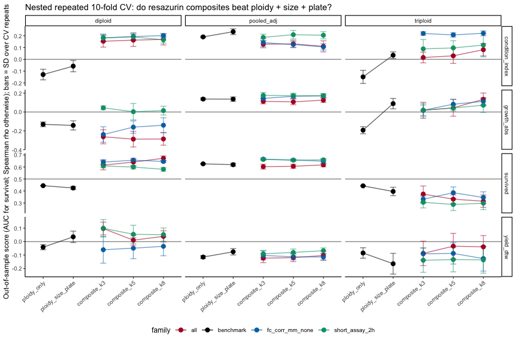<!-- -->

``` r
ggsave(file.path(fig_dir, "nested_composite_cv.png"), p_comp, width = 11, height = 8)
```

``` r
nested_selection %>% filter(phenotype == "survived", family == "all", k == max(composite_k)) %>%
  group_by(stratum) %>% slice_max(selection_freq, n = 8, with_ties = FALSE) %>% ungroup() %>%
  transmute(stratum, scale, feature, adjustment, selection_freq = round(selection_freq, 2)) %>%
  kable(caption = sprintf("Indices most often selected inside the CV loop (survival, all indices, k = %d). Frequency 1 = chosen in every fold of every repeat.", max(composite_k)))
```

| stratum     | scale          | feature                        | adjustment | selection\_freq |
|:------------|:---------------|:-------------------------------|:-----------|----------------:|
| diploid     | fc\_corr\_mm   | final\_value                   | resid      |            0.99 |
| diploid     | fc\_corr\_mm   | mean\_rate                     | resid      |            0.99 |
| diploid     | fc\_corr\_mm   | peak\_value                    | resid      |            0.84 |
| diploid     | fc\_corr\_mm   | value\_4h                      | resid      |            0.77 |
| diploid     | fc\_corr       | peak\_value                    | resid      |            0.70 |
| diploid     | fc\_corr       | final\_value                   | resid      |            0.65 |
| diploid     | fc\_corr       | mean\_rate                     | resid      |            0.50 |
| diploid     | fc\_corr\_mm   | auc\_total                     | resid      |            0.41 |
| pooled\_adj | raw\_rfu       | n\_negative\_intervals         | none       |            0.93 |
| pooled\_adj | raw\_rfu       | depression\_abs                | none       |            0.83 |
| pooled\_adj | fc\_corr       | metabolic\_depression\_index   | none       |            0.66 |
| pooled\_adj | raw\_delta\_mm | depression\_abs                | none       |            0.65 |
| pooled\_adj | fc\_corr       | resilience\_ratio              | none       |            0.62 |
| pooled\_adj | fc\_corr\_mm   | depression\_abs                | none       |            0.56 |
| pooled\_adj | fc\_corr       | depression\_abs                | none       |            0.50 |
| pooled\_adj | raw\_rfu       | metabolic\_depression\_index   | none       |            0.40 |
| triploid    | raw\_rfu       | inflection\_time               | none       |            0.92 |
| triploid    | raw\_rfu       | time\_to\_vmax                 | resid      |            0.91 |
| triploid    | raw\_rfu       | n\_negative\_intervals         | resid      |            0.52 |
| triploid    | raw\_rfu       | time\_to\_min\_slope           | none       |            0.39 |
| triploid    | raw\_rfu       | inflection\_time               | resid      |            0.35 |
| triploid    | raw\_rfu       | baseline\_value                | none       |            0.33 |
| triploid    | raw\_rfu       | time\_to\_peak                 | none       |            0.29 |
| triploid    | fc\_corr       | delta\_auc\_late\_minus\_early | none       |            0.28 |

Indices most often selected inside the CV loop (survival, all indices, k
= 8). Frequency 1 = chosen in every fold of every repeat.

# 14 PCA: what are the main axes of metabolic variation, and do they matter?

``` r
pca_ids <- index_dictionary %>% filter(scale == "fc_corr_mm", adjustment == "none", completeness >= min_completeness) %>% pull(index_id)
Xp <- as.matrix(joined[, pca_ids]); rownames(Xp) <- joined$trace_id
Xp <- apply(Xp, 2, function(z) { z[!is.finite(z)] <- median(z, na.rm = TRUE); z })
pca <- prcomp(Xp, center = TRUE, scale. = TRUE)
var_expl <- round(100 * pca$sdev^2 / sum(pca$sdev^2), 1)
cat("Variance explained by PC1-5 (%):", var_expl[1:5], "\n")

pca_scores <- as_tibble(pca$x[, 1:4], rownames = "trace_id") %>% left_join(phen, by = "trace_id")
pca_loadings <- as_tibble(pca$rotation[, 1:4], rownames = "index_id") %>%
  left_join(index_dictionary %>% select(index_id, feature), by = "index_id")
write_csv(pca_loadings, file.path(out_dir, "pca_loadings.csv"))

pca_assoc <- map_dfr(paste0("PC", 1:4), function(pc) {
  map_dfr(strata_names, function(s) {
    d <- if (s == "pooled_adj") pca_scores %>% group_by(ploidy) %>% mutate(sc = as.numeric(scale(.data[[pc]]))) %>% ungroup()
         else pca_scores %>% filter(ploidy == s) %>% mutate(sc = .data[[pc]])
    ds <- d %>% filter(!is.na(survived))
    R <- rank(ds$sc); n1 <- sum(ds$survived == 1); n0 <- nrow(ds) - n1
    tibble(pc = pc, stratum = s, var_expl_pct = var_expl[as.integer(str_remove(pc, "PC"))],
           auc_survival = (sum(R[ds$survived == 1]) - n1 * (n1 + 1) / 2) / (n1 * n0),
           p_survival = suppressWarnings(wilcox.test(sc ~ survived, data = ds)$p.value),
           rho_growth = cor(d$sc, d$growth_abs, method = "spearman", use = "complete.obs"),
           rho_CI = cor(d$sc, d$condition_index, method = "spearman", use = "complete.obs"),
           rho_yield = cor(d$sc, d$yield_dtw, method = "spearman", use = "complete.obs"))
  })
})
write_csv(pca_assoc, file.path(out_dir, "pca_index.csv"))
pca_assoc %>% mutate(across(where(is.numeric), ~ round(.x, 3))) %>% kable(caption = "PCA axes of the fc_corr_mm feature set vs field outcomes")

pca_loadings %>% select(feature, PC1, PC2) %>%
  mutate(across(c(PC1, PC2), ~ round(.x, 2))) %>%
  arrange(desc(abs(PC1))) %>% slice_head(n = 12) %>% kable(caption = "Largest PC1 loadings (PC2 alongside)")
```

    Variance explained by PC1-5 (%): 61.8 14.2 13 5.5 2.1 

| pc  | stratum     | var\_expl\_pct | auc\_survival | p\_survival | rho\_growth | rho\_CI | rho\_yield |
|:----|:------------|---------------:|--------------:|------------:|------------:|--------:|-----------:|
| PC1 | pooled\_adj |           61.8 |         0.456 |       0.437 |      -0.066 |   0.008 |     -0.073 |
| PC1 | diploid     |           61.8 |         0.310 |       0.065 |       0.073 |   0.177 |     -0.048 |
| PC1 | triploid    |           61.8 |         0.511 |       0.880 |      -0.187 |  -0.203 |     -0.087 |
| PC2 | pooled\_adj |           14.2 |         0.498 |       0.969 |      -0.012 |  -0.034 |     -0.021 |
| PC2 | diploid     |           14.2 |         0.567 |       0.522 |      -0.058 |  -0.192 |     -0.010 |
| PC2 | triploid    |           14.2 |         0.468 |       0.659 |       0.086 |   0.231 |     -0.003 |
| PC3 | pooled\_adj |           13.0 |         0.469 |       0.582 |      -0.027 |   0.036 |     -0.010 |
| PC3 | diploid     |           13.0 |         0.351 |       0.148 |      -0.046 |   0.051 |     -0.062 |
| PC3 | triploid    |           13.0 |         0.518 |       0.810 |      -0.014 |  -0.018 |      0.021 |
| PC4 | pooled\_adj |            5.5 |         0.475 |       0.655 |       0.074 |  -0.022 |     -0.039 |
| PC4 | diploid     |            5.5 |         0.462 |       0.715 |       0.033 |  -0.168 |     -0.213 |
| PC4 | triploid    |            5.5 |         0.487 |       0.862 |       0.110 |   0.130 |      0.101 |

PCA axes of the fc\_corr\_mm feature set vs field outcomes

| feature      |   PC1 |   PC2 |
|:-------------|------:|------:|
| peak\_value  | -0.25 |  0.13 |
| auc\_total   | -0.25 |  0.00 |
| auc\_late    | -0.25 |  0.08 |
| value\_3h    | -0.25 |  0.09 |
| auc\_0\_3h   | -0.25 | -0.10 |
| final\_value | -0.24 |  0.14 |
| mean\_rate   | -0.24 |  0.14 |
| value\_2h    | -0.24 | -0.08 |
| value\_4h    | -0.24 |  0.14 |
| auc\_early   | -0.23 | -0.19 |
| lin\_slope   | -0.23 |  0.20 |
| auc\_0\_2h   | -0.23 | -0.20 |

Largest PC1 loadings (PC2 alongside)

``` r
p_pca <- pca_scores %>% filter(!is.na(survived)) %>%
  ggplot(aes(PC1, PC2, colour = ploidy, shape = factor(survived, labels = c("dead", "alive")))) +
  geom_point(size = 2.2, alpha = 0.8) +
  scale_colour_manual(values = c(diploid = "#0072B2", triploid = "#D55E00")) +
  scale_shape_manual(values = c(dead = 4, alive = 16), name = "Field outcome") +
  labs(x = sprintf("PC1 (%.0f%%)", var_expl[1]), y = sprintf("PC2 (%.0f%%)", var_expl[2]),
       title = "Metabolic PCA of the size-normalized curve features") +
  theme_classic(base_size = 11)
p_pca
```

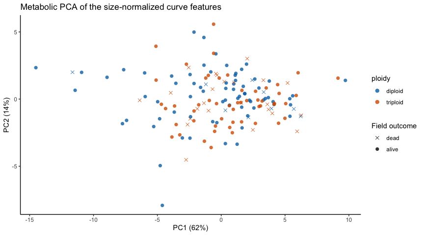<!-- -->

``` r
ggsave(file.path(fig_dir, "pca_scores.png"), p_pca, width = 7, height = 5.5)
```

# 15 Does the index-survival relationship differ by ploidy?

``` r
top_pooled <- screen_survival %>% filter(stratum == "pooled_adj") %>%
  slice_max(abs(auc - 0.5), n = 12, with_ties = FALSE) %>% pull(index_id)
Xz <- zscore_within(as.matrix(surv_df[, colnames(X)]), surv_df$ploidy)

ploidy_interaction <- map_dfr(top_pooled, function(id) {
  d <- data.frame(y = surv_df$survived, z = Xz[, id], pl = surv_df$ploidy) %>% filter(is.finite(z))
  f0 <- glm(y ~ z + pl, family = binomial, data = d); f1 <- glm(y ~ z * pl, family = binomial, data = d)
  cf <- summary(f1)$coefficients
  tibble(index_id = id, n = nrow(d),
         or_per_sd_diploid = exp(cf["z", 1]), or_per_sd_triploid = exp(cf["z", 1] + cf["z:pltriploid", 1]),
         interaction_p = anova(f0, f1, test = "Chisq")$`Pr(>Chi)`[2])
}) %>% left_join(index_dictionary %>% select(index_id, scale, feature, adjustment), by = "index_id") %>%
  left_join(screen_survival %>% filter(stratum == "diploid") %>% select(index_id, auc_diploid = auc), by = "index_id") %>%
  left_join(screen_survival %>% filter(stratum == "triploid") %>% select(index_id, auc_triploid = auc), by = "index_id")
write_csv(ploidy_interaction, file.path(out_dir, "ploidy_interaction.csv"))

ploidy_interaction %>% transmute(scale, feature, adjustment, n, auc_diploid = round(auc_diploid, 3),
                                 auc_triploid = round(auc_triploid, 3), or_per_sd_diploid = round(or_per_sd_diploid, 2),
                                 or_per_sd_triploid = round(or_per_sd_triploid, 2), interaction_p = signif(interaction_p, 2)) %>%
  kable(caption = "Top pooled survival indices: does the slope differ between ploidies?")
```

| scale          | feature                      | adjustment |   n | auc\_diploid | auc\_triploid | or\_per\_sd\_diploid | or\_per\_sd\_triploid | interaction\_p |
|:---------------|:-----------------------------|:-----------|----:|-------------:|--------------:|---------------------:|----------------------:|---------------:|
| raw\_rfu       | n\_negative\_intervals       | none       | 156 |        0.559 |         0.570 |                 1.37 |                  1.35 |           0.98 |
| raw\_rfu       | depression\_abs              | none       | 156 |        0.498 |         0.552 |                 0.92 |                  1.13 |           0.63 |
| raw\_delta\_mm | depression\_abs              | none       | 156 |        0.496 |         0.551 |                 0.92 |                  1.13 |           0.63 |
| raw\_rfu       | metabolic\_depression\_index | none       | 156 |        0.504 |         0.546 |                 1.03 |                  1.12 |           0.85 |
| raw\_rfu       | resilience\_ratio            | none       | 156 |        0.496 |         0.454 |                 0.97 |                  0.89 |           0.85 |
| raw\_delta     | resilience\_ratio            | none       | 156 |        0.496 |         0.454 |                 0.97 |                  0.89 |           0.85 |
| fc\_corr       | metabolic\_depression\_index | none       | 156 |        0.504 |         0.547 |                 1.03 |                  1.12 |           0.86 |
| fc\_corr       | resilience\_ratio            | none       | 156 |        0.496 |         0.453 |                 0.97 |                  0.89 |           0.86 |
| fc\_corr\_mm   | depression\_abs              | none       | 156 |        0.495 |         0.552 |                 0.88 |                  1.11 |           0.57 |
| fc\_corr       | depression\_abs              | none       | 156 |        0.498 |         0.552 |                 0.88 |                  1.12 |           0.57 |
| raw\_delta\_mm | max\_drop                    | none       | 156 |        0.541 |         0.562 |                 1.02 |                  1.22 |           0.70 |
| raw\_rfu       | max\_drop                    | none       | 156 |        0.543 |         0.562 |                 1.03 |                  1.20 |           0.75 |

Top pooled survival indices: does the slope differ between ploidies?

``` r
pw <- screen_survival %>% select(stratum, index_id, scale, feature, adjustment, auc) %>%
  pivot_wider(names_from = stratum, values_from = auc) %>%
  mutate(lab = if_else(abs(diploid - 0.5) > 0.15 | abs(triploid - 0.5) > 0.15,
                       paste0(feature, " [", scale, ifelse(adjustment == "resid", ", r", ""), "]"), NA_character_))
p_pl <- ggplot(pw, aes(diploid, triploid, colour = scale)) +
  geom_hline(yintercept = 0.5, colour = "grey70") + geom_vline(xintercept = 0.5, colour = "grey70") +
  geom_abline(slope = 1, intercept = 0, linetype = 2, colour = "grey50") +
  geom_point(alpha = 0.6, size = 1.6) +
  geom_text_repel(aes(label = lab), size = 2.4, max.overlaps = 20, show.legend = FALSE, na.rm = TRUE) +
  labs(x = "AUC for survival (diploid)", y = "AUC for survival (triploid)",
       title = "Do the same indices predict survival in both ploidies?",
       subtitle = "Points on the diagonal behave the same in both; off-diagonal indices are ploidy-specific") +
  theme_classic(base_size = 10)
p_pl
```

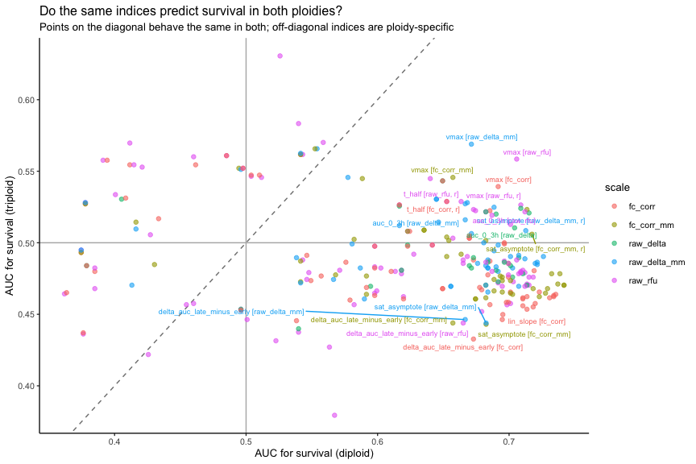<!-- -->

``` r
ggsave(file.path(fig_dir, "diploid_vs_triploid_survival_auc.png"), p_pl, width = 9, height = 7)
```

# 16 Screening utility: what would culling on the index buy?

Using each animal’s mean out-of-fold prediction from the nested CV (so
no animal’s outcome informed its own score), animals are binned into
quintiles of predicted survival within each stratum. If the assay is
useful as a screen, survival should rise across quintiles and removing
the bottom quintile should raise realized survival.

``` r
best_fam <- nested_composite_cv %>% filter(phenotype == "survived", family != "benchmark") %>%
  group_by(stratum) %>% slice_max(cv_auc, n = 1, with_ties = FALSE) %>% ungroup() %>% select(stratum, family, k, cv_auc)

screening_utility <- map_dfr(seq_len(nrow(best_fam)), function(i) {
  b <- best_fam[i, ]
  composite_preds[[paste("survived", b$stratum, b$family, b$k)]] %>%
    mutate(quintile = ntile(pred, 5)) %>%
    group_by(stratum, family, k, quintile) %>%
    summarise(n = n(), survival_pct = 100 * mean(y), .groups = "drop") %>%
    group_by(stratum) %>%
    mutate(overall_survival_pct = 100 * sum(n * survival_pct / 100) / sum(n),
           survival_if_bottom_quintile_culled_pct = 100 * sum((n * survival_pct / 100)[quintile > 1]) / sum(n[quintile > 1]),
           cv_auc = b$cv_auc) %>% ungroup()
})
write_csv(screening_utility, file.path(out_dir, "screening_utility.csv"))

screening_utility %>% mutate(across(where(is.numeric), ~ round(.x, 2))) %>%
  kable(caption = "Realized survival by quintile of out-of-sample predicted survival (best composite per stratum)")

p_util <- ggplot(screening_utility, aes(factor(quintile), survival_pct, fill = stratum)) +
  geom_col(position = "dodge") +
  geom_hline(aes(yintercept = overall_survival_pct, colour = stratum), linetype = 2, show.legend = FALSE) +
  scale_fill_manual(values = c(pooled_adj = "grey40", diploid = "#0072B2", triploid = "#D55E00")) +
  scale_colour_manual(values = c(pooled_adj = "grey40", diploid = "#0072B2", triploid = "#D55E00")) +
  labs(x = "Quintile of out-of-sample predicted survival (1 = predicted worst)", y = "Realized field survival (%)",
       title = "Screening utility of the best cross-validated composite", subtitle = "Dashed: overall survival in that stratum") +
  theme_classic(base_size = 10)
p_util
```

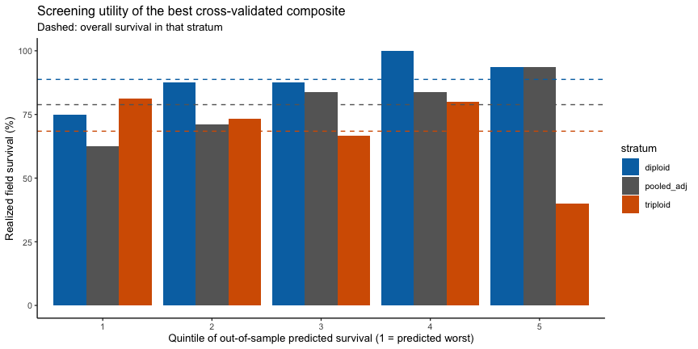<!-- -->

``` r
ggsave(file.path(fig_dir, "screening_utility.png"), p_util, width = 8, height = 4.5)
```

| stratum     | family             |   k | quintile |   n | survival\_pct | overall\_survival\_pct | survival\_if\_bottom\_quintile\_culled\_pct | cv\_auc |
|:------------|:-------------------|----:|---------:|----:|--------------:|-----------------------:|--------------------------------------------:|--------:|
| diploid     | all                |   8 |        1 |  16 |         75.00 |                  88.75 |                                       92.19 |    0.67 |
| diploid     | all                |   8 |        2 |  16 |         87.50 |                  88.75 |                                       92.19 |    0.67 |
| diploid     | all                |   8 |        3 |  16 |         87.50 |                  88.75 |                                       92.19 |    0.67 |
| diploid     | all                |   8 |        4 |  16 |        100.00 |                  88.75 |                                       92.19 |    0.67 |
| diploid     | all                |   8 |        5 |  16 |         93.75 |                  88.75 |                                       92.19 |    0.67 |
| pooled\_adj | fc\_corr\_mm\_none |   3 |        1 |  32 |         62.50 |                  78.85 |                                       83.06 |    0.67 |
| pooled\_adj | fc\_corr\_mm\_none |   3 |        2 |  31 |         70.97 |                  78.85 |                                       83.06 |    0.67 |
| pooled\_adj | fc\_corr\_mm\_none |   3 |        3 |  31 |         83.87 |                  78.85 |                                       83.06 |    0.67 |
| pooled\_adj | fc\_corr\_mm\_none |   3 |        4 |  31 |         83.87 |                  78.85 |                                       83.06 |    0.67 |
| pooled\_adj | fc\_corr\_mm\_none |   3 |        5 |  31 |         93.55 |                  78.85 |                                       83.06 |    0.67 |
| triploid    | fc\_corr\_mm\_none |   5 |        1 |  16 |         81.25 |                  68.42 |                                       65.00 |    0.39 |
| triploid    | fc\_corr\_mm\_none |   5 |        2 |  15 |         73.33 |                  68.42 |                                       65.00 |    0.39 |
| triploid    | fc\_corr\_mm\_none |   5 |        3 |  15 |         66.67 |                  68.42 |                                       65.00 |    0.39 |
| triploid    | fc\_corr\_mm\_none |   5 |        4 |  15 |         80.00 |                  68.42 |                                       65.00 |    0.39 |
| triploid    | fc\_corr\_mm\_none |   5 |        5 |  15 |         40.00 |                  68.42 |                                       65.00 |    0.39 |

Realized survival by quintile of out-of-sample predicted survival (best
composite per stratum)

# 17 Best-index scatter and trajectory contrast

``` r
best_s <- screen_survival %>% filter(stratum == "triploid") %>% slice_max(abs(auc - 0.5), n = 1, with_ties = FALSE)
best_g <- screen_continuous %>% filter(phenotype == "growth_abs") %>% slice_max(abs(spearman_rho), n = 1, with_ties = FALSE)
growth_plot_df <- if (best_g$stratum == "pooled_adj") joined else joined %>% filter(ploidy == best_g$stratum)

p_b1 <- surv_df %>% filter(ploidy == "triploid", is.finite(.data[[best_s$index_id]])) %>%
  ggplot(aes(factor(survived, labels = c("dead", "alive")), .data[[best_s$index_id]], colour = factor(survived))) +
  geom_jitter(width = 0.12, alpha = 0.7) + stat_summary(fun = median, geom = "crossbar", width = 0.4, colour = "black") +
  scale_colour_manual(values = c("0" = "#B2182B", "1" = "#4393C3"), guide = "none") +
  labs(x = "Field outcome (triploid)", y = best_s$index_id,
       title = sprintf("Best triploid survival index: %s", best_s$feature),
       subtitle = sprintf("AUC = %.2f | MW p = %.3g | family-wise p = %.2f", best_s$auc, best_s$mw_p, best_s$fw_perm_p)) +
  theme_classic(base_size = 10)

p_b2 <- growth_plot_df %>% filter(is.finite(.data[[best_g$index_id]]), is.finite(growth_abs)) %>%
  ggplot(aes(.data[[best_g$index_id]], growth_abs, colour = ploidy)) +
  geom_point(alpha = 0.7) + geom_smooth(method = "lm", se = TRUE, alpha = 0.15) +
  scale_colour_manual(values = c(diploid = "#0072B2", triploid = "#D55E00")) +
  labs(x = best_g$index_id, y = "Growth in shell height (mm, assay -> sampling)",
       title = sprintf("Best growth index: %s (%s)", best_g$feature, best_g$stratum),
       subtitle = sprintf("Spearman rho = %.2f | family-wise p = %.2f", best_g$spearman_rho, best_g$fw_perm_p)) +
  theme_classic(base_size = 10)
p_b1 + p_b2
```

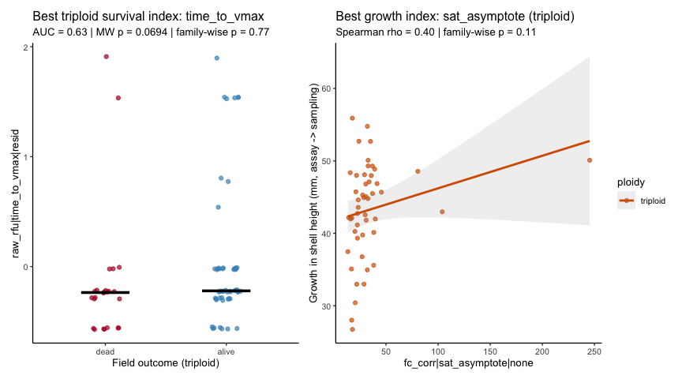<!-- -->

``` r
ggsave(file.path(fig_dir, "best_index_scatter.png"), p_b1 + p_b2, width = 12, height = 5)
```

``` r
p_tc <- signal_long %>% filter(scale %in% c("raw_delta", "fc_corr_mm")) %>%
  inner_join(phen %>% select(trace_id, survived), by = "trace_id") %>%
  filter(!is.na(survived)) %>%
  mutate(outcome = factor(survived, labels = c("dead", "alive"))) %>%
  group_by(scale, ploidy, outcome, timepoint) %>%
  summarise(time_hr = mean(time_hr), m = mean(value), se = sd(value) / sqrt(n()), .groups = "drop") %>%
  ggplot(aes(time_hr, m, colour = outcome, linetype = outcome)) +
  geom_ribbon(aes(ymin = m - se, ymax = m + se, fill = outcome), alpha = 0.15, colour = NA) +
  geom_line() + geom_point() +
  facet_grid(scale ~ ploidy, scales = "free_y") +
  scale_colour_manual(values = c(dead = "#B2182B", alive = "#4393C3")) +
  scale_fill_manual(values = c(dead = "#B2182B", alive = "#4393C3")) +
  labs(x = "Elapsed hours", y = "Mean +/- SE", title = "Mean resazurin trajectory of animals that later died vs survived") +
  theme_classic(base_size = 10)
p_tc
```

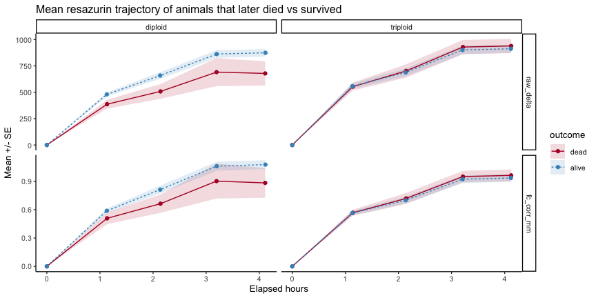<!-- -->

``` r
ggsave(file.path(fig_dir, "trajectory_by_outcome.png"), p_tc, width = 9, height = 6)
```

# 18 Synthesis

``` r
fmt <- function(x, d = 2) formatC(x, digits = d, format = "f")
cat("## What the data say (auto-generated from this render)\n\n")
```

## 18.1 What the data say (auto-generated from this render)

``` r
ss <- screen_survival %>% group_by(stratum) %>% slice_max(abs(auc - 0.5), n = 1, with_ties = FALSE)
cat("**Survival.** Best single index per stratum (AUC, permutation family-wise p):\n\n")
```

**Survival.** Best single index per stratum (AUC, permutation
family-wise p):

``` r
for (i in seq_len(nrow(ss))) cat(sprintf("- %s: `%s` on `%s`%s, AUC = %s (n = %d, %d dead), MW p = %s, family-wise p = %s\n",
  ss$stratum[i], ss$feature[i], ss$scale[i], ifelse(ss$adjustment[i] == "resid", " (size/plate-adjusted)", ""),
  fmt(ss$auc[i]), ss$n[i], ss$n_dead[i], formatC(ss$mw_p[i], digits = 2, format = "g"), fmt(ss$fw_perm_p[i])))
```

-   diploid: `final_value` on `fc_corr_mm` (size/plate-adjusted), AUC =
    0.74 (n = 80, 9 dead), MW p = 0.019, family-wise p = 0.32
-   pooled\_adj: `n_negative_intervals` on `raw_rfu`, AUC = 0.63 (n =
    156, 33 dead), MW p = 0.02, family-wise p = 0.41
-   triploid: `time_to_vmax` on `raw_rfu` (size/plate-adjusted), AUC =
    0.63 (n = 76, 24 dead), MW p = 0.069, family-wise p = 0.77

``` r
n_fw <- sum(screen_survival$fw_perm_p < 0.05, na.rm = TRUE)
cat(sprintf("\n%d of %d index x stratum tests clear the permutation family-wise 0.05 threshold for survival.\n\n",
            n_fw, nrow(screen_survival)))
```

0 of 852 index x stratum tests clear the permutation family-wise 0.05
threshold for survival.

``` r
sc <- screen_continuous %>% group_by(phenotype) %>% slice_max(abs(spearman_rho), n = 1, with_ties = FALSE)
cat("**Continuous performance.** Best single index per phenotype (any stratum):\n\n")
```

**Continuous performance.** Best single index per phenotype (any
stratum):

``` r
for (i in seq_len(nrow(sc))) cat(sprintf("- %s: `%s` on `%s`%s in %s, rho = %s (n = %d), family-wise p = %s\n",
  sc$phenotype[i], sc$feature[i], sc$scale[i], ifelse(sc$adjustment[i] == "resid", " (adj)", ""), sc$stratum[i],
  fmt(sc$spearman_rho[i]), sc$n[i], fmt(sc$fw_perm_p[i])))
```

-   condition\_index: `delta_auc_late_minus_early` on `raw_rfu` in
    diploid, rho = -0.35 (n = 71), family-wise p = 0.09
-   cup: `baseline_value` on `raw_rfu` (adj) in triploid, rho = -0.33 (n
    = 52), family-wise p = 0.36
-   dry\_tissue\_weight: `rate_h2` on `fc_corr_mm` (adj) in triploid,
    rho = 0.42 (n = 52), family-wise p = 0.08
-   growth\_abs: `sat_asymptote` on `fc_corr` in triploid, rho = 0.40 (n
    = 49), family-wise p = 0.11
-   perf\_composite: `sat_asymptote` on `fc_corr` in triploid, rho =
    0.40 (n = 49), family-wise p = 0.11
-   yield\_dtw: `time_to_vmax` on `raw_rfu` (adj) in triploid, rho =
    0.23 (n = 76), family-wise p = 0.63

``` r
cat("\n**Cross-validated composites vs benchmarks (survival, CV AUC):**\n\n")
```

**Cross-validated composites vs benchmarks (survival, CV AUC):**

``` r
cv_s <- nested_composite_cv %>% filter(phenotype == "survived")
for (s in strata_names) {
  bm <- cv_s %>% filter(stratum == s, model == "ploidy_size_plate") %>% pull(cv_auc)
  bc <- cv_s %>% filter(stratum == s, family != "benchmark") %>% slice_max(cv_auc, n = 1, with_ties = FALSE)
  cat(sprintf("- %s: ploidy+size+plate benchmark AUC = %s; best composite (%s, k = %d) AUC = %s\n",
              s, fmt(bm), bc$family, bc$k, fmt(bc$cv_auc)))
}
```

-   pooled\_adj: ploidy+size+plate benchmark AUC = 0.62; best composite
    (fc\_corr\_mm\_none, k = 3) AUC = 0.67
-   diploid: ploidy+size+plate benchmark AUC = 0.43; best composite
    (all, k = 8) AUC = 0.67
-   triploid: ploidy+size+plate benchmark AUC = 0.40; best composite
    (fc\_corr\_mm\_none, k = 5) AUC = 0.39

``` r
cat("\n**Cross-validated composites vs benchmarks (growth, CV Spearman):**\n\n")
```

**Cross-validated composites vs benchmarks (growth, CV Spearman):**

``` r
cv_g <- nested_composite_cv %>% filter(phenotype == "growth_abs")
for (s in strata_names) {
  bm <- cv_g %>% filter(stratum == s, model == "ploidy_size_plate") %>% pull(cv_spearman)
  bc <- cv_g %>% filter(stratum == s, family != "benchmark") %>% slice_max(cv_spearman, n = 1, with_ties = FALSE)
  cat(sprintf("- %s: benchmark rho = %s; best composite (%s, k = %d) rho = %s\n", s, fmt(bm), bc$family, bc$k, fmt(bc$cv_spearman)))
}
```

-   pooled\_adj: benchmark rho = 0.14; best composite (short\_assay\_2h,
    k = 3) rho = 0.18
-   diploid: benchmark rho = -0.14; best composite (short\_assay\_2h, k
    = 3) rho = 0.04
-   triploid: benchmark rho = 0.09; best composite (all, k = 8) rho =
    0.13

``` r
su <- screening_utility %>% distinct(stratum, overall_survival_pct, survival_if_bottom_quintile_culled_pct, cv_auc)
cat("\n**Screening utility (out-of-sample):**\n\n")
```

**Screening utility (out-of-sample):**

``` r
for (i in seq_len(nrow(su))) cat(sprintf("- %s: overall survival %s%% -> %s%% if the predicted-worst quintile were culled (composite CV AUC = %s)\n",
  su$stratum[i], fmt(su$overall_survival_pct[i], 1), fmt(su$survival_if_bottom_quintile_culled_pct[i], 1), fmt(su$cv_auc[i])))
```

-   diploid: overall survival 88.8% -&gt; 92.2% if the predicted-worst
    quintile were culled (composite CV AUC = 0.67)
-   pooled\_adj: overall survival 78.8% -&gt; 83.1% if the
    predicted-worst quintile were culled (composite CV AUC = 0.67)
-   triploid: overall survival 68.4% -&gt; 65.0% if the predicted-worst
    quintile were culled (composite CV AUC = 0.39)

``` r
sc_best <- scale_comparison %>% filter(phenotype == "survived", stratum == "triploid") %>% arrange(desc(abs(best_assoc))) %>% slice_head(n = 3)
cat("\n**Normalization (triploid survival):** best scales are ",
    paste(sprintf("`%s/%s` (|2AUC-1| = %s)", sc_best$scale, sc_best$adjustment, fmt(abs(sc_best$best_assoc))), collapse = ", "), ".\n", sep = "")
```

**Normalization (triploid survival):** best scales are `raw_rfu/resid`
(\|2AUC-1\| = 0.26), `raw_rfu/none` (\|2AUC-1\| = 0.24),
`raw_delta_mm/none` (\|2AUC-1\| = 0.14).

## 18.2 Interpretation

The numbered results above regenerate on every render; the notes below
are the analyst’s reading of the data as of this render and should be
revisited if the inputs change.

-   **No single resazurin index clears the permutation ceiling for
    survival.** With \~280 distinct indices, the best of them reaches an
    AUC of about 0.68 in the pooled stratum and about 0.81 in diploids
    by chance alone at these death counts (see the “95% null” columns).
    The observed maxima (0.63 and 0.74) sit below those ceilings, and
    every family-wise p is above 0.3. The existing finding that nothing
    survives BH correction on the `fc_corr_mm` scale therefore does not
    change when the catalogue is widened to raw fluorescence, absolute
    resorufin production, kinetic fits, or truncated windows.
-   **The strongest survival hint is in diploids, and it points to
    metabolic *capacity*.** Size-and-plate-adjusted `final_value`,
    `mean_rate`, `peak_value` and `auc_total` on the fold-change scales
    all give AUC \~0.72 to 0.74 with only nine deaths: diploids that
    produced *more* resorufin per mm at 40 C were more likely to be
    alive at sampling. A nested composite of these holds an
    out-of-sample AUC of about 0.67 against a ploidy + size
    -   plate benchmark near 0.43. That is a real but modest gain on
        nine events, and it is the direction opposite to the
        family-level heat-survival result in the USDA families, where
        high capacity under heat predicted *lower* survival. Interpret
        this as a hypothesis for the next diploid deployment, not as a
        validated screen.
-   **In triploids the assay carries no detectable survival signal.**
    Despite three times as many deaths as in diploids, no index exceeds
    AUC 0.63 in either direction, the nested composites fall *below* 0.5
    (the signature of selecting on noise), and the top hits are timing
    features (`time_to_vmax`, `inflection_time`) on the raw scale that
    do not replicate across scales. Whatever killed the triploids in the
    field is not visible in their 4-hour 40 C resazurin trajectory at
    deployment.
-   **Growth and condition show the most coherent continuous signal, and
    it is triploid-specific.** `sat_asymptote` (the fitted plateau of a
    saturating curve on the fold-change scales),
    `delta_auc_late_minus_early` and `rate_h2` correlate at rho \~0.3 to
    0.4 with growth, dry tissue weight and the within-ploidy performance
    composite in triploids (family-wise p \~0.08 to 0.11, the closest
    any index comes to the ceiling), and single-index CV retains roughly
    two-thirds of that. In diploids the same indices go the *other* way
    for condition index. Taken together with the survival result,
    capacity-type indices appear to mean different things in the two
    ploidies, which argues for scoring ploidies separately rather than
    pooling.
-   **Normalization matters less than expected, adjustment matters
    more.** The size/plate residualized versions of the fold-change
    indices dominate the diploid survival ranking, while the
    un-normalized raw scale dominates the weak triploid ranking.
    Dividing by shell length (`fc_corr_mm`) versus not (`fc_corr`)
    changes little once plate and size are regressed out. The practical
    recommendation is to keep the existing `fc_corr_mm` pipeline but
    always test features after adjusting for assay size and plate.
-   **A 2-hour read is not clearly worse than 4 hours.** The
    `short_assay_2h` composite is within one SD of the best full-assay
    composite for pooled survival and matches or exceeds it for growth
    and condition, and the assay-duration curves are flat after 2 h in
    the pooled stratum. If the assay is to be run at scale, this is the
    result to pursue.
-   **Screening value today is small.** Culling the predicted-worst
    quintile on the best out-of-sample composite would raise realized
    survival by three to four percentage points in diploids and the
    pooled set, and would lower it in triploids. The assay is not yet a
    usable survival screen for this cohort.

## 18.3 Recommended next steps

1.  Record the field sampling date and days at sea so growth can be
    expressed per day; set `field_sampling_date` at the top of this
    notebook.
2.  Add a non-stressed (ambient temperature) control run on the same
    animals so that stress *response* (40 C minus ambient) can join the
    catalogue.
3.  Re-run with the 2025-08-13 cohort once its field outcomes exist; the
    catalogue and screens are cohort-agnostic and will gain power
    fastest from more deaths, not more indices.
4.  If a composite consistently beats the benchmark, lock its recipe
    (scale, features, k) and validate it prospectively on the next
    deployment.

# 19 Session info

``` r
sessionInfo()
```

    R version 4.3.2 (2023-10-31)
    Platform: aarch64-apple-darwin20 (64-bit)
    Running under: macOS Sonoma 14.7.6

    Matrix products: default
    BLAS:   /Library/Frameworks/R.framework/Versions/4.3-arm64/Resources/lib/libRblas.0.dylib 
    LAPACK: /Library/Frameworks/R.framework/Versions/4.3-arm64/Resources/lib/libRlapack.dylib;  LAPACK version 3.11.0

    locale:
    [1] C

    time zone: America/Los_Angeles
    tzcode source: internal

    attached base packages:
    [1] stats     graphics  grDevices utils     datasets  methods   base     

    other attached packages:
     [1] knitr_1.48      patchwork_1.3.1 ggrepel_0.9.6   here_1.0.1     
     [5] readxl_1.4.3    lubridate_1.9.3 forcats_1.0.0   stringr_1.5.1  
     [9] dplyr_1.1.4     purrr_1.0.2     readr_2.1.5     tidyr_1.3.1    
    [13] tibble_3.2.1    ggplot2_3.5.2   tidyverse_2.0.0

    loaded via a namespace (and not attached):
     [1] utf8_1.2.4         generics_0.1.3     lattice_0.22-6     stringi_1.8.4     
     [5] hms_1.1.3          digest_0.6.37      magrittr_2.0.3     evaluate_1.0.0    
     [9] grid_4.3.2         timechange_0.3.0   RColorBrewer_1.1-3 fastmap_1.2.0     
    [13] Matrix_1.6-1.1     cellranger_1.1.0   rprojroot_2.0.4    mgcv_1.9-1        
    [17] fansi_1.0.6        scales_1.4.0       textshaping_0.4.0  cli_3.6.3         
    [21] rlang_1.1.4        crayon_1.5.3       splines_4.3.2      bit64_4.5.2       
    [25] withr_3.0.1        yaml_2.3.10        parallel_4.3.2     tools_4.3.2       
    [29] tzdb_0.4.0         vctrs_0.6.5        R6_2.5.1           lifecycle_1.0.4   
    [33] bit_4.5.0          vroom_1.6.5        ragg_1.3.3         pkgconfig_2.0.3   
    [37] pillar_1.9.0       gtable_0.3.6       glue_1.8.0         Rcpp_1.1.0        
    [41] systemfonts_1.1.0  highr_0.11         xfun_0.48          tidyselect_1.2.1  
    [45] farver_2.1.2       nlme_3.1-166       htmltools_0.5.8.1  labeling_0.4.3    
    [49] rmarkdown_2.28     compiler_4.3.2    
